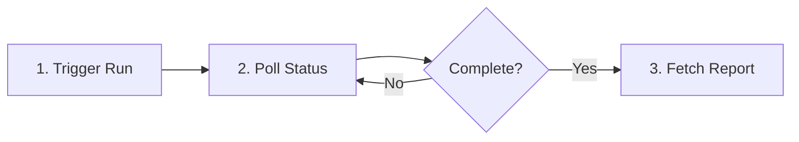

# Running Tests via API

This guide shows how to trigger test runs and retrieve results using the Muggle Test API.

## Workflow Overview



## Step 1: Trigger a Run

Send a `POST` request to start executing test scripts.

### Request

```http
POST /api/muggle-test/projects/{projectId}/runs
Authorization: Bearer YOUR_API_KEY
Content-Type: application/json

{
  "scriptIds": ["script-123", "script-456"],
  "runName": "Nightly regression"
}
```

### Request Body Fields

| Field       | Type     | Required | Description                   |
| :---------- | :------- | :------: | :---------------------------- |
| `scriptIds` | string[] |          | Scripts to run (omit for all) |
| `runName`   | string   |          | Label for this run            |

### Response

```json
{
  "runId": "run_abc123",
  "status": "queued",
  "createdAt": "2024-01-15T10:30:00Z"
}
```

| Field       | Type   | Description                   |
| :---------- | :----- | :---------------------------- |
| `runId`     | string | Unique identifier for polling |
| `status`    | string | Initial status (`queued`)     |
| `createdAt` | string | ISO 8601 timestamp            |

## Step 2: Poll Run Status

Check the status of a running test batch.

### Request

```http
GET /api/muggle-test/projects/{projectId}/runs/{runId}
Authorization: Bearer YOUR_API_KEY
```

### Response

```json
{
  "runId": "run_abc123",
  "status": "running",
  "progress": {
    "total": 10,
    "completed": 6,
    "passed": 5,
    "failed": 1
  },
  "updatedAt": "2024-01-15T10:32:00Z"
}
```

### Status Values

| Status      | Description            | Terminal? |
| :---------- | :--------------------- | :-------: |
| `queued`    | Waiting to start       |           |
| `running`   | In progress            |           |
| `completed` | Finished successfully  |     ✓     |
| `failed`    | Finished with failures |     ✓     |
| `cancelled` | Stopped by user        |     ✓     |

### Polling Best Practices

| Practice      | Recommendation                      |
| :------------ | :---------------------------------- |
| Initial delay | Wait 5 seconds before first poll    |
| Poll interval | 10-30 seconds between checks        |
| Timeout       | Set maximum wait (e.g., 30 minutes) |
| Backoff       | Increase interval if no progress    |

## Step 3: Fetch Reports

Once a run is complete, retrieve the detailed report.

### Request

```http
GET /api/muggle-test/projects/{projectId}/runs/{runId}/report
Authorization: Bearer YOUR_API_KEY
```

### Response

```json
{
  "runId": "run_abc123",
  "summary": {
    "total": 10,
    "passed": 8,
    "failed": 2,
    "passRate": 80.0
  },
  "scripts": [
    {
      "scriptId": "script-123",
      "name": "User Login",
      "status": "passed",
      "duration": 12500
    },
    {
      "scriptId": "script-456",
      "name": "Checkout Flow",
      "status": "failed",
      "failedStep": {
        "index": 4,
        "action": "Click 'Complete Purchase' button",
        "error": "Element not found",
        "screenshotUrl": "https://..."
      }
    }
  ]
}
```

## CI/CD Integration Example

Use in CI/CD to gate deployments on test results:

```bash
#!/bin/bash
set -e

# Trigger run
RESPONSE=$(curl -s -X POST \
  "https://api.muggle-ai.com/api/muggle-test/projects/$PROJECT_ID/runs" \
  -H "Authorization: Bearer $API_KEY" \
  -H "Content-Type: application/json" \
  -d '{"runName": "CI Run"}')

RUN_ID=$(echo $RESPONSE | jq -r '.runId')

# Poll until complete
while true; do
  STATUS=$(curl -s \
    "https://api.muggle-ai.com/api/muggle-test/projects/$PROJECT_ID/runs/$RUN_ID" \
    -H "Authorization: Bearer $API_KEY" | jq -r '.status')
  
  case $STATUS in
    completed) echo "Tests passed"; exit 0 ;;
    failed)    echo "Tests failed"; exit 1 ;;
    cancelled) echo "Tests cancelled"; exit 1 ;;
    *)         sleep 15 ;;
  esac
done
```

## Error Responses

| Error                   | Cause                  | Solution               |
| :---------------------- | :--------------------- | :--------------------- |
| `404 Project not found` | Invalid project ID     | Verify ID in dashboard |
| `404 Run not found`     | Invalid run ID         | Check trigger response |
| `400 No scripts`        | Project has no scripts | Generate scripts first |
| `429 Rate limited`      | Too many requests      | Back off and retry     |

## Next Steps

| Goal                | Resource                                          |
| :------------------ | :------------------------------------------------ |
| Full CI/CD examples | [CI/CD Integration](mcp/mcp-cicd-integration.md)  |
| Use AI assistants   | [MCP Gateway](mcp/mcp-overview)                   |
| Troubleshooting     | [Common Issues](troubleshooting/common-issues.md) |
