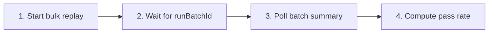

# Running Tests via API

Trigger test runs and read results programmatically over the Muggle Test REST API. The flow is a **bulk replay**: start a workflow runtime, wait for it to produce a run batch, then poll the batch summary for pass/fail counts.

> The same flow wrapped in a complete GitHub Actions, Azure DevOps, or GitLab pipeline is in [CI/CD Integration](mcp/mcp-cicd-integration.md).

## Base URL and Authentication

All endpoints are under `https://promptservice.muggle-ai.com` and require an API key header:

```http
x-api-key: mai_sk_your_api_key_here
```

## Workflow Overview


```mermaid
flowchart LR
    A["1. Start bulk replay"] --> B["2. Wait for runBatchId"]
    B --> C["3. Poll batch summary"]
    C --> D["4. Compute pass rate"]
```

## Step 1: Start a Bulk Replay

Create a workflow runtime that replays the project's test scripts.

```http
POST /v1/protected/muggle-test/workflow/test-script/test-script-replay/bulk/workflowRuntimes
x-api-key: mai_sk_your_api_key_here
Content-Type: application/json

{
  "projectId": "proj_abc123",
  "namePrefix": "ci"
}
```

| Field        | Type   | Required | Description                       |
| :----------- | :----- | :------: | :-------------------------------- |
| `projectId`  | string |    ✓     | Project whose scripts to replay   |
| `namePrefix` | string |          | Label prefix for the run batch    |

The response returns the workflow runtime `id`.

```json
{
  "id": "wfrt_replay_123"
}
```

## Step 2: Wait for the Run Batch

Poll the latest run until it exposes a `runBatchId` in its `result` payload.

```http
GET /v1/protected/muggle-test/workflow/test-script/test-script-replay/bulk/{workflowRuntimeId}/run/latest
x-api-key: mai_sk_your_api_key_here
```

`result` may be a JSON string or object; once the batch exists it contains `runBatchId`. Keep polling (for example every 20 seconds) until it appears.

## Step 3: Poll the Batch Summary

Fetch the batch summary until nothing is running or pending.

```http
GET /v1/protected/muggle-test/workflow/test-script/test-script-replay/bulk/run-batch/{runBatchId}/summary
x-api-key: mai_sk_your_api_key_here
```

### Response

```json
{
  "successCount": 8,
  "failedCount": 2,
  "canceledCount": 0,
  "runningCount": 0,
  "pendingCount": 0
}
```

| Field           | Description                  |
| :-------------- | :--------------------------- |
| `successCount`  | Scripts that passed          |
| `failedCount`   | Scripts that failed          |
| `canceledCount` | Scripts that were canceled   |
| `runningCount`  | Still executing              |
| `pendingCount`  | Queued, not yet started      |

The batch is finished when `runningCount` and `pendingCount` are both `0`. Compute pass rate over executed runs only (skipped runs are excluded):

```text
passRate = successCount / (successCount + failedCount + canceledCount)
```

## Step 4 (Optional): Generate a Report

After the batch finishes, generate and deliver a project report. Delivery channels come from the project's report preferences.

```http
POST /v1/protected/muggle-test/report/final/generate
x-api-key: mai_sk_your_api_key_here
Content-Type: application/json

{ "projectId": "proj_abc123", "exportFormat": "html", "channels": [] }
```

## Error Responses

| Status | Meaning                          | Action                                      |
| :----: | :------------------------------- | :------------------------------------------ |
|  401   | Missing or invalid API key       | Check the `x-api-key` header                |
|  403   | No access to the project         | Verify the key's account can access it      |
|  404   | Runtime or batch not yet ready   | Keep polling; it may not exist yet          |
|  429   | Rate limited                     | Back off and retry                          |

## Next Steps

| Goal                 | Resource                                          |
| :------------------- | :------------------------------------------------ |
| Full CI/CD pipelines | [CI/CD Integration](mcp/mcp-cicd-integration.md)  |
| Use AI assistants    | [Remote Testing Overview](mcp/overview.md)        |
| Troubleshooting      | [Common Issues](troubleshooting/common-issues.md) |
