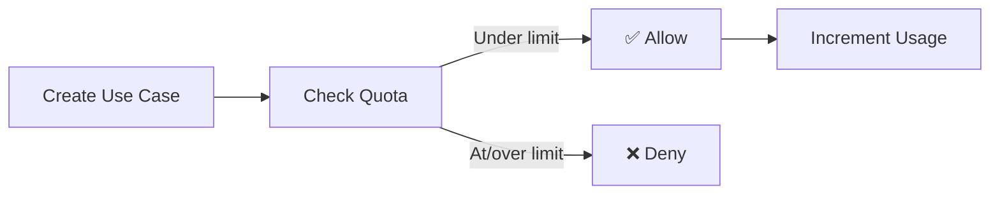

# Quotas and Limits

This page explains how quota enforcement works in Muggle Test and how to manage your resource usage effectively.

## How Quotas Work

Quotas are enforced **per project**. Each project has its own usage count, and limits are based on your subscription plan.



### What's Counted

| Resource | What Counts | What Doesn't Count |
| :------- | :---------- | :----------------- |
| **Use Cases** | All use cases regardless of status | Deleted use cases |
| **Test Cases** | All test cases regardless of status | Deleted test cases |
| **Candidates** | Active candidates in the review queue | Archived candidates |

### Status Doesn't Matter

All use cases and test cases count toward your quota, regardless of their status:

| Status | Counts? |
| :----- | :------ |
| Draft | Yes |
| In Review | Yes |
| Approved | Yes |
| Archived | Yes |
| **Deleted** | **No** |

## Quota Enforcement Scenarios

### Creating a Single Item

When you create a use case or test case manually:

| Quota Status | Result |
| :----------- | :----- |
| Under limit | Item is created |
| At limit | Error: "Use case limit reached. You have X/Y use cases." |

### Batch Operations

When approving multiple use case candidates:

| Quota Status | Result |
| :----------- | :----- |
| All fit | All candidates are approved |
| Partial fit | Candidates up to remaining quota are approved; rest are skipped |
| None fit | No candidates are approved; error message shown |

**Example**: You have 8/10 use cases and try to approve 5 candidates:
- 2 candidates are approved (reaching your limit of 10)
- 3 candidates are skipped
- You see: "2 processed, 3 skipped due to quota limit"

### Automated Workflows

For test case detection workflows:

| Phase | Behavior |
| :---- | :------- |
| **Start** | Checks if at least 1 test case can be created |
| **Each iteration** | Checks quota before creating each test case |
| **At limit** | Workflow completes with partial results |

The workflow doesn't fail—it achieves **partial success** and reports what was created.

## Quota Exemptions

Some accounts and projects may be exempt from quota enforcement:

| Exemption Type | When Applied |
| :------------- | :----------- |
| **User-level** | Enterprise accounts with unlimited plans |
| **Project-level** | Projects migrated from before quota enforcement |
| **Admin override** | Special cases granted by support |

Exempt accounts see "unlimited" in quota displays.

## Managing Your Quota

### Freeing Up Space

To create room for new use cases or test cases:

| Action | Effect |
| :----- | :----- |
| Delete unused use cases | Reduces use case count |
| Delete unused test cases | Reduces test case count |
| Archive candidates | Doesn't affect quota (candidates don't count) |

### Best Practices

| Practice | Benefit |
| :------- | :------ |
| Review before approving | Only approve candidates you'll actually use |
| Delete obsolete items | Keep quota available for new tests |
| Organize by project | Spread usage across multiple projects |
| Monitor usage | Check quota before batch operations |

## API Quota Information

### Get Current Quota Status

```
GET /api/muggleTest/projects/{projectId}/useCaseDiscoveryMemory
```

**Response:**
```json
{
  "memory": {
    "id": "memory-123",
    "projectId": "proj-456",
    "useCaseCandidates": [...]
  },
  "useCaseQuota": {
    "currentUsage": 7,
    "limit": 10,
    "remaining": 3,
    "isExempt": false
  }
}
```

### Quota Fields Explained

| Field | Description |
| :---- | :---------- |
| `currentUsage` | Number of use cases currently in the project |
| `limit` | Maximum allowed based on your plan |
| `remaining` | How many more you can create (`limit - currentUsage`) |
| `isExempt` | Whether quota enforcement is disabled |

### Graduation Response with Quota Info

When approving candidates:

```
POST /api/muggleTest/projects/{projectId}/useCaseDiscoveryMemory/graduations
```

**Response includes quota info when limits apply:**
```json
{
  "approved": [...],
  "inReview": [...],
  "memory": {...},
  "quotaInfo": {
    "resourceType": "USE_CASE",
    "limitReached": true,
    "processedCount": 2,
    "skippedCount": 3,
    "currentUsage": 10,
    "limit": 10,
    "message": "Quota limit reached. 2 processed, 3 skipped."
  }
}
```

## Error Messages

| Message | Meaning | Solution |
| :------ | :------ | :------- |
| "Use case limit reached" | You've hit your use case quota | Delete unused use cases or upgrade |
| "Test case limit reached" | You've hit your test case quota | Delete unused test cases or upgrade |
| "X processed, Y skipped" | Partial success due to quota | Review which items were skipped |

## FAQ

### Do archived items count toward quota?

Yes, archived use cases and test cases still count. Only **deleted** items are removed from the count.

### Can I move use cases between projects?

Not currently. Each project has its own separate quota.

### What happens to my tests if I downgrade?

Existing use cases and test cases remain, but you won't be able to create new ones until you're under the new limit.

### Is there a grace period when hitting limits?

No. Limits are enforced immediately. Plan upgrades also take effect immediately.

## Next Steps

| Goal | Resource |
| :--- | :------- |
| Compare plans | [Subscription Plans](subscription-plans.md) |
| Upgrade your plan | [Billing Dashboard](/muggleTestV0/dashboard/billing) |
| Learn about use cases | [How Muggle Test Works](../concepts/how-muggle-test-works.md) |
