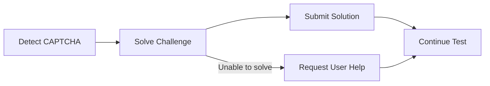

# Automated CAPTCHA Handling

Muggle Test automatically handles CAPTCHAs encountered during test execution, allowing your tests to run uninterrupted through protected pages.

## Why This Matters

CAPTCHAs are designed to block automated access, which traditionally makes them a major obstacle for end-to-end testing. Without automated handling, tests would fail or require manual intervention whenever a CAPTCHA appears.

| Challenge                        | How Muggle Test Helps                              |
| :------------------------------- | :------------------------------------------------- |
| Tests blocked by CAPTCHAs        | Automatically solves common CAPTCHA types          |
| Manual intervention required     | No human input needed during test runs             |
| Inconsistent test results        | Reliable execution through protected flows         |
| Testing login and sign-up flows  | Complete coverage of authentication journeys       |

## Supported CAPTCHA Types

Muggle Test can automatically handle the following CAPTCHA types:

| CAPTCHA Type         | Description                                      |
| :------------------- | :----------------------------------------------- |
| **reCAPTCHA v2**     | Checkbox ("I'm not a robot") challenges          |
| **reCAPTCHA v3**     | Invisible score-based verification               |
| **hCaptcha**         | Image selection and checkbox challenges          |
| **Image CAPTCHAs**   | Text recognition from distorted images           |

## How It Works

When the AI agent encounters a CAPTCHA during test execution:

| Step                | What Happens                                           |
| :------------------ | :----------------------------------------------------- |
| **Detection**       | Agent recognizes CAPTCHA elements on the page          |
| **Solving**         | Challenge is processed and solved automatically        |
| **Submission**      | Solution is submitted to the page                      |
| **Continuation**    | Test proceeds to the next step                         |

## Fallback Behavior

If a CAPTCHA cannot be solved automatically (e.g., unsupported type or service unavailable), the agent will pause and request user intervention. This ensures your tests can still complete with minimal disruption.

## Best Practices

| Recommendation                          | Reason                                                  |
| :-------------------------------------- | :------------------------------------------------------ |
| Test on staging with CAPTCHAs disabled  | Faster test execution when protection isn't needed      |
| Use automated handling for production   | Validates the real user experience including CAPTCHAs   |
| Review failed CAPTCHA steps             | May indicate new CAPTCHA types or configuration issues  |

## Limitations

| Limitation                     | Notes                                                    |
| :----------------------------- | :------------------------------------------------------- |
| **Slider CAPTCHAs**            | Not currently supported (drag-to-complete puzzles)       |
| **Audio CAPTCHAs**             | Not supported                                            |
| **Custom enterprise CAPTCHAs** | May require additional configuration                     |

## Next Steps

| Goal                        | Resource                                                                    |
| :-------------------------- | :-------------------------------------------------------------------------- |
| Run your first test         | [Quickstart: Running Tests](../getting-started/quickstart-running-tests.md) |
| Understand test execution   | [How Muggle Test Works](how-muggle-test-works.md)                           |
| Troubleshoot CAPTCHA issues | [Common Issues](../troubleshooting/common-issues.md)                        |
