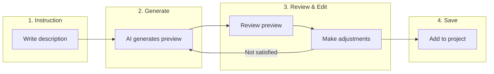

# Generating Use Cases and Test Cases from Instructions

Muggle Test lets you create use cases and test cases by describing what you want in plain language. Instead of filling out forms manually, simply write a short instruction and let AI generate the details for you.

## Overview

| Phase | What Happens |
| :---- | :----------- |
| **Instruction** | You describe what you want to test in natural language |
| **Generate** | AI creates a structured preview based on your description |
| **Review & Edit** | You review, modify, or regenerate the preview |
| **Save** | You add the finalized items to your project |

## Adding Use Cases from Instructions

Use cases represent user flows or scenarios you want to test. Generate them quickly by describing the user journey.

### How to Generate a Use Case

1. Open your project in the Muggle Test dashboard
2. Navigate to the **Use Cases** section
3. Click **Add Use Case** and select **Generate from Instruction**
4. Write your instruction in the text area
5. Click **Generate Preview**
6. Review and edit the generated use case
7. Click **Add to test plan** when satisfied

### Writing Effective Use Case Instructions

| Do | Don't |
| :- | :---- |
| Describe the user's goal clearly | Write vague single words |
| Include the key steps involved | List every micro-interaction |
| Mention the expected outcome | Assume the AI knows your domain |
| Reference specific features | Use internal jargon without context |

### Example Instructions

| Instruction | What Gets Generated |
| :---------- | :------------------ |
| "As a logged-in user, I can add items to cart from product page, view cart, update quantity, and proceed to checkout" | Shopping cart flow with breakdown for each step |
| "User registers with email, receives verification email, clicks link, and completes profile setup" | Registration flow with verification steps |
| "Admin can create new user accounts, assign roles, and deactivate existing users" | User management use case with CRUD operations |

### What the Preview Includes

| Field | Description |
| :---- | :---------- |
| **Title** | Short name for the use case |
| **Category** | Subsystem or service that owns this flow |
| **URL** | Starting page for the flow |
| **User Story** | "As a [user], I want to [action] so that [benefit]" |
| **Description** | Detailed explanation of the scenario |
| **Breakdown** | Individual sub-scenarios with requirements and acceptance criteria |
| **Status** | Approval status (defaults to Approved) |
| **Priority** | Importance level for test execution |

## Adding Test Cases from Instructions

Test cases are specific scenarios derived from a use case. Generate multiple test cases at once by describing what aspects you want to verify.

### How to Generate Test Cases

1. Open a use case in your project
2. Click **Add Test Cases** and select **Generate from Instruction**
3. Review the context panel showing the use case details
4. Write your instruction describing what to test
5. Click **Generate Preview**
6. Review the generated test cases
7. Select which test cases to add using checkboxes
8. Click **Add Selected to Plan**

### Writing Effective Test Case Instructions

| Do | Don't |
| :- | :---- |
| Specify the scenarios to cover | Repeat the use case description |
| Mention edge cases and error conditions | Focus only on happy paths |
| Include boundary conditions | Write overly generic instructions |
| Reference existing test coverage to avoid duplication | Ignore what's already tested |

### Example Instructions

| Instruction | What Gets Generated |
| :---------- | :------------------ |
| "Test user login with valid credentials, invalid password, and locked account scenarios" | Three test cases covering success and failure paths |
| "Verify cart updates correctly when changing quantity to 0, 1, and maximum allowed" | Boundary testing for quantity field |
| "Test checkout with expired card, insufficient funds, and successful payment" | Payment validation test cases |

### What Each Test Case Preview Includes

| Field | Description |
| :---- | :---------- |
| **Title** | Short descriptive name |
| **Goal** | What the test verifies |
| **Description** | Detailed test scenario |
| **Precondition** | Required state before test runs |
| **Expected Result** | What should happen when test passes |
| **Priority** | Test importance level |
| **Category** | Test grouping label |
| **Tags** | Keywords for filtering |
| **URL** | Starting page for the test |

## Working with Previews

### Editing Generated Content

All fields in the preview are editable. Click any field to modify:

| Action | How To |
| :----- | :----- |
| Edit text fields | Click and type directly |
| Change priority/status | Use the dropdown selector |
| Modify breakdown items | Expand the item and edit |
| Add breakdown items | Click **Add Item** button |
| Remove breakdown items | Click **Remove** on the item |

### Regenerating the Preview

If the generated preview doesn't match your expectations:

1. Refine your instruction with more detail
2. Click **Generate Preview** again
3. The new preview replaces the current one completely

### Abandoning a Proposal

If you want to start over or cancel:

1. Click **Abandon Proposal** in the preview section
2. The preview is cleared
3. You can write a new instruction or close the modal

### Selecting Test Cases

When generating test cases, you can select which ones to add:

| Action | Result |
| :----- | :----- |
| **Select All** | Checks all generated test cases |
| **Deselect All** | Unchecks all test cases |
| **Individual checkbox** | Toggles single test case selection |

Only selected test cases are added when you click **Add Selected to Plan**.

## Best Practices

### For Better AI Generation

| Tip | Benefit |
| :-- | :------ |
| Be specific about user roles | Generates appropriate permissions context |
| Include success and failure scenarios | More comprehensive test coverage |
| Mention integration points | Captures cross-system interactions |
| Describe expected data | Generates realistic test scenarios |

### For Efficient Workflows

| Tip | Benefit |
| :-- | :------ |
| Review existing use cases first | Avoid duplicate coverage |
| Start with high-priority flows | Focus AI on critical paths |
| Edit rather than regenerate | Preserve good parts of the preview |
| Use consistent terminology | Easier to search and organize |

## Context Awareness

The AI uses available context to generate better results:

### For Use Cases

| Context | How It Helps |
| :------ | :----------- |
| **Project name** | Understands the application domain |
| **Project description** | Knows what the system does |

### For Test Cases

| Context | How It Helps |
| :------ | :----------- |
| **Use case title** | Generates relevant test scenarios |
| **User story** | Understands the user's goal |
| **Existing test cases** | Avoids generating duplicates |

## Troubleshooting

### Common Issues

| Issue | Solution |
| :---- | :------- |
| Generated content is too generic | Add more specific details to your instruction |
| Missing important scenarios | Explicitly mention edge cases in your instruction |
| Wrong domain assumptions | Include context about your application |
| Duplicate test cases generated | Reference existing tests in your instruction |

### Tips for Better Results

| Situation | What to Try |
| :-------- | :---------- |
| AI misunderstands intent | Rephrase using "As a [user], I want to [action]" format |
| Too few breakdown items | Ask for "comprehensive" or "detailed" coverage |
| Too many breakdown items | Ask for "key" or "essential" scenarios only |

## Next Steps

| Goal | Resource |
| :--- | :------- |
| Upload PRD files instead | [Uploading PRD Files](prd-upload.md) |
| Run your generated tests | [Quickstart: Running Tests](../getting-started/quickstart-running-tests.md) |
| Understand test execution | [How Muggle Test Works](how-muggle-test-works.md) |
