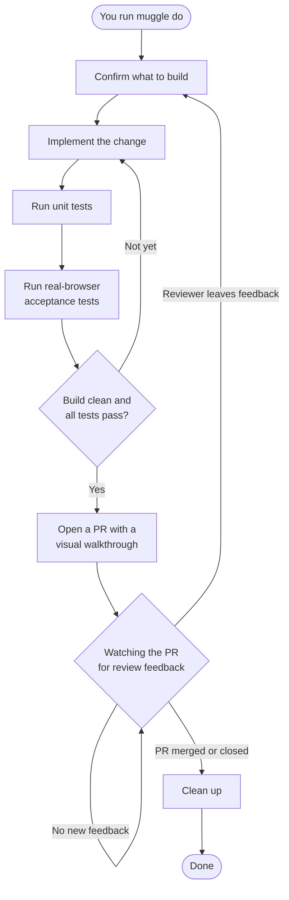

# How Muggle Do Works

`muggle do` runs a full development cycle for you — from a plain-language request to a tested, review-ready pull request. You answer one short set of questions up front, then it works on its own: writing the change, testing it in a real browser, opening a PR with visual proof, and following up on review feedback until the PR is merged.

## The Workflow

## What Each Step Does

| Step | What happens |
| :--- | :--- |
| **Confirm what to build** | You answer one short questionnaire describing the change and how to test it. After that, no further input is needed. |
| **Implement the change** | The change is written to match your existing code's style and structure. |
| **Run unit tests** | The unit suite runs to catch logic regressions early. |
| **Real-browser acceptance tests** | Muggle Test detects which user flows your change affects and runs end-to-end acceptance tests on them in a real browser. |
| **Quality gate** | A PR is opened only once the build is clean, unit tests pass, and acceptance results are recorded. If a check fails, it loops back and tries again. |
| **Open a PR** | A pull request is opened with a visual walkthrough — screenshots and pass/fail results for every flow tested. |
| **Follow up on reviews** | While the PR is open, it watches for reviewer feedback. Each time a reviewer comments, it applies the changes, re-tests, pushes an update, and replies — repeating until the PR is merged or closed. |
| **Clean up** | Once the PR is merged, it tidies up the working branch. |

## Why This Matters

| Without muggle do | With muggle do |
| :--- | :--- |
| Context-switching between coding, testing, and PR review | One command runs the whole cycle |
| Manually browser-testing every changed flow | Affected flows are acceptance-tested automatically |
| Reviewers see code with no proof it works | Every PR carries a visual walkthrough of passing flows |
| Review feedback waits until you circle back | Feedback is addressed and re-tested as it arrives |
