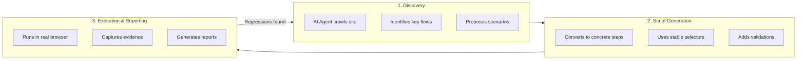
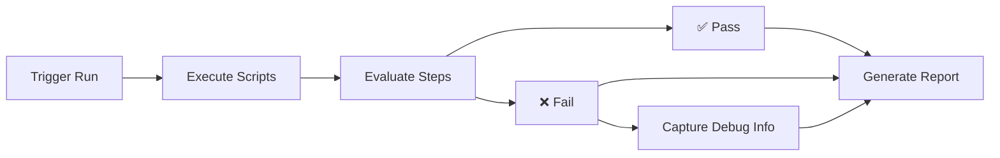

# How Muggle Test Works

At a high level, Muggle Test does three things:

1. **Discover** important flows in your app
2. **Generate** executable test scripts from those flows
3. **Re-run** those scripts on every change and surface regressions

## Discovery

Muggle Test uses an AI agent in a real browser to explore your application.

### How Discovery Works

| Phase        | Description                                                |
| :----------- | :--------------------------------------------------------- |
| **Crawl**    | Start from your base URL and navigate links/buttons        |
| **Identify** | Recognize key pages and actions (login, forms, dashboards) |
| **Propose**  | Create labeled scenarios in your project                   |

### What the Agent Handles

| Challenge            | How It's Solved                                     |
| :------------------- | :-------------------------------------------------- |
| Multi-step workflows | Agent follows realistic user paths                  |
| Dynamic content      | Waits for async loading to complete                 |
| Authentication       | Uses provided credentials to access protected areas |

## Test Scripts

Each discovered scenario becomes a sequence of concrete steps.

### Example Steps

| Step | Description                                   |
| :--- | :-------------------------------------------- |
| 1    | Click **Sign in** button                      |
| 2    | Type email into field labeled **Email**       |
| 3    | Type password into field labeled **Password** |
| 4    | Click **Submit**                              |
| 5    | Wait for dashboard to finish loading          |

### Script Stability

| Strategy             | Benefit                                    |
| :------------------- | :----------------------------------------- |
| Human-visible labels | More stable than brittle CSS selectors     |
| Flexible matching    | Tolerates minor layout and content changes |
| Smart waits          | Handles varying load times                 |

## Runs and Reports

When you run tests, scripts execute in a browser environment.

### What's Captured on Failure

| Artifact             | Purpose                         |
| :------------------- | :------------------------------ |
| **URL**              | Where the failure occurred      |
| **Step description** | What action was attempted       |
| **Screenshot**       | Visual state at failure time    |
| **Error summary**    | Technical details for debugging |

### How Reports Help

| Use Case               | Benefit                              |
| :--------------------- | :----------------------------------- |
| See health at a glance | Know which flows are working         |
| Prioritize fixes       | Focus on business-critical failures  |
| Share with team        | Non-engineers can understand results |

## Next Steps

| Goal              | Resource                                                                    |
| :---------------- | :-------------------------------------------------------------------------- |
| Get started       | [Quickstart: Running Tests](getting-started/quickstart-running-tests.md)    |
| Integrate via API | [API Overview](api/api-overview.md)                                         |
| Use AI assistants | [MCP Gateway Overview](mcp/mcp-overview)                                    |
