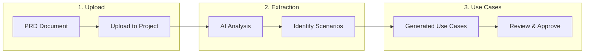

# Uploading PRD Files

Muggle Test can automatically extract test scenarios from your Product Requirements Documents (PRDs). Instead of manually defining use cases, upload your existing documentation and let AI identify the key flows to test.

## Overview

| Phase | What Happens |
| :---- | :----------- |
| **Upload** | You provide a PRD file (TXT, PDF, DOC, DOCX) |
| **Extraction** | AI reads the document and identifies testable scenarios |
| **Use Cases** | Scenarios become use cases ready for test generation |

## Supported File Formats

| Format | Extension | Notes |
| :----- | :-------- | :---- |
| Plain Text | `.txt` | Best for simple, clean documents |
| PDF | `.pdf` | Supports text extraction from standard PDFs |
| Word Document | `.doc`, `.docx` | Microsoft Word formats |

## How to Upload a PRD

### From the Dashboard

1. Open your project in the Muggle Test dashboard
2. Navigate to the **Use Cases** section
3. Click **Add Use Cases from PRD**
4. Drag and drop your file or click to browse
5. Wait for processing to complete

### During Project Creation

1. Create a new project with your website URL
2. In the **Add Use Cases** step, select **Upload PRD**
3. Upload your requirements document
4. Review the extracted use cases before proceeding

## What Gets Extracted

The AI analyzes your PRD to identify:

| Element | Description |
| :------ | :---------- |
| **User Stories** | "As a user, I want to..." statements |
| **Acceptance Criteria** | Specific conditions that must be met |
| **User Flows** | Step-by-step interactions with the system |
| **Business Rules** | Logic that should be validated |

### Example Extraction

**From this PRD text:**
> Users should be able to log in with email and password. After successful login, they should see their dashboard with recent activity. Failed login attempts should show an error message.

**Muggle Test extracts:**

| Use Case | Description |
| :------- | :---------- |
| Successful Login | User logs in with valid credentials and sees dashboard |
| Failed Login | User enters invalid credentials and sees error message |
| Dashboard Display | Logged-in user sees recent activity on dashboard |

## Duplicate Detection

Muggle Test automatically detects duplicate file uploads to prevent redundant processing.

### How It Works

| Scenario | Result |
| :------- | :----- |
| Same file uploaded twice to **same project** | Blocked - shows existing file |
| Same file uploaded to **different projects** | Allowed - each project processes independently |
| Modified file with same name | Allowed - content is different |

### What Happens on Duplicate

When you upload a file that already exists in the project:

1. The upload is rejected with a clear message
2. The duplicate file is automatically cleaned up
3. You're shown the existing file's information
4. You can choose to reprocess the existing file instead

## Best Practices

### Writing PRD Content for Better Extraction

| Do | Don't |
| :- | :---- |
| Use clear user story format | Write vague requirements |
| Include specific acceptance criteria | Leave success conditions undefined |
| Describe step-by-step flows | Assume implicit knowledge |
| List error scenarios | Focus only on happy paths |

### Organizing Your Documents

| Tip | Benefit |
| :-- | :------ |
| One feature per section | Cleaner use case grouping |
| Use headers and bullet points | Easier parsing |
| Include examples | More concrete test scenarios |

## After Upload

Once your PRD is processed:

| Step | Action |
| :--- | :----- |
| **Review** | Check extracted use cases for accuracy |
| **Edit** | Modify titles, descriptions, or priorities |
| **Approve** | Move use cases to active status |
| **Generate** | Create test scripts from approved use cases |

## Processing Status

| Status | Meaning |
| :----- | :------ |
| **Pending** | File uploaded, waiting to process |
| **Running** | AI is analyzing the document |
| **Completed** | Use cases extracted successfully |
| **Failed** | Processing error (check file format) |

## Troubleshooting

### Common Issues

| Issue | Solution |
| :---- | :------- |
| No use cases extracted | Ensure PRD contains clear requirements |
| Processing stuck | Check file isn't corrupted or empty |
| Duplicate error | Use the existing file or delete it first |
| Format not supported | Convert to TXT, PDF, DOC, or DOCX |

### File Size Limits

| Limit | Value |
| :---- | :---- |
| Maximum file size | 10 MB |
| Recommended size | Under 2 MB for faster processing |

## Next Steps

| Goal | Resource |
| :--- | :------- |
| Generate test scripts | [How Muggle Test Works](how-muggle-test-works.md) |
| Run your tests | [Quickstart: Running Tests](../getting-started/quickstart-running-tests.md) |
| Use API for uploads | [API Overview](../api/api-overview.md) |
