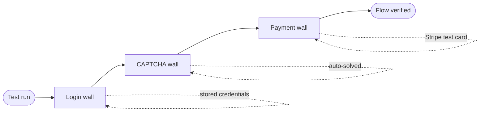

# Testing Behind Payment, Login, and CAPTCHA Walls

Your most important flows — checkout, the member dashboard, account creation — usually sit behind a gate. This guide shows how to test through each gate with Muggle Test without charging a real card, leaking a real password, or getting blocked by a challenge.

| Wall            | How you get through it                                          | What you provide                          |
| :-------------- | :------------------------------------------------------------- | :---------------------------------------- |
| **Payment**     | Put the app in Stripe test mode and pay with a test card        | The test card number to use in the prompt |
| **Login**       | Muggle Test signs in with credentials you store on the project | A dedicated test account                  |
| **CAPTCHA**     | Muggle Test detects and solves the challenge automatically      | Nothing — it is handled for you           |

## Payment Wall

Test checkout against [Stripe test mode](https://docs.stripe.com/testing). Test mode uses the same flows as live mode but never moves real money, so you can run checkout on every build.

### Setup

| Step | Action                                                                                     |
| :--- | :----------------------------------------------------------------------------------------- |
| 1    | Point your app's environment at your Stripe **test** keys (`pk_test_…` / `sk_test_…`)       |
| 2    | Confirm the checkout page is in test mode — Stripe Elements shows a "TEST MODE" badge       |
| 3    | Tell Muggle Test which test card to use in your instruction                                |

> ⚠️ Never enter a real card number, even in test mode. Stripe rejects live cards on test keys, and real cards on a live key would create a real charge.

### Test Cards

Use any **future** expiry date, any 3-digit CVC (4 digits for American Express), and any postal/ZIP code.

**Successful payment**

| Card number           | Brand            |
| :-------------------- | :--------------- |
| `4242 4242 4242 4242` | Visa             |
| `5555 5555 5555 4444` | Mastercard       |
| `3782 822463 10005`   | American Express |
| `6011 1111 1111 1117` | Discover         |

**Declines and errors**

| Card number           | Result                                |
| :-------------------- | :------------------------------------ |
| `4000 0000 0000 0002` | Generic decline                       |
| `4000 0000 0000 9995` | Insufficient funds                    |
| `4000 0000 0000 0069` | Expired card                          |
| `4000 0000 0000 0127` | Incorrect CVC                         |
| `4000 0000 0000 0119` | Processing error                      |

**3D Secure / authentication required**

| Card number           | Result                                          |
| :-------------------- | :---------------------------------------------- |
| `4000 0025 0000 3155` | Prompts a 3D Secure authentication step         |
| `4000 0027 6000 3184` | Requires authentication on every transaction    |

Stripe maintains the full list — including bank-specific declines, dispute simulations, and test clocks for subscriptions — at [docs.stripe.com/testing](https://docs.stripe.com/testing).

### Example Instruction

> "Test checkout on `localhost:3000/cart`. Add the Pro plan, go to checkout, and pay with Stripe test card `4242 4242 4242 4242`, expiry `12/34`, CVC `123`, ZIP `12345`. Verify the order confirmation page appears."

To test the failure path, swap in a decline card and verify your app shows the right error:

> "Repeat checkout with declined card `4000 0000 0000 0002` and verify an 'Your card was declined' message appears and no order is created."

## Login Wall

Muggle Test signs in to protected areas using credentials you store on the project, then runs the rest of the flow as an authenticated user.

### Provide a Test Account

Use a dedicated test account — never a real user's credentials.

| Where you run | How to supply credentials                                                                 |
| :------------ | :---------------------------------------------------------------------------------------- |
| **Remote** (staging/production via MCP) | Save them under **Login Credentials** in your project settings, or store them as project secrets |
| **Local** (localhost) | Provide them in your instruction, or save them so the `autoLogin` preference can reuse them |

Stored credentials are reused across runs, so you set them once. The [`autoLogin` preference](local-testing/preferences.md) controls whether Muggle Test reuses saved credentials silently (`always`), asks first (`ask`, the default), or never reuses them (`never`).

### Example Instruction

> "Log in to `localhost:3000` as `test@example.com` / `Test1234!`, then open the billing page and verify the current plan is shown."

### SSO and Two-Factor Accounts

Automated sign-in cannot complete an interactive SSO redirect or a one-time 2FA code. For gated flows that normally require these:

| Situation                  | Recommendation                                                            |
| :------------------------- | :------------------------------------------------------------------------ |
| 2FA on the test account    | Disable 2FA on the test account, or use a test environment without it     |
| SSO-only login             | Point Muggle Test at a staging environment that allows password login     |
| Locked or expired account  | Reset or recreate the test account                                        |

If sign-in keeps failing, see [Login Keeps Failing](troubleshooting/common-issues.md#login-keeps-failing).

## CAPTCHA Wall

Muggle Test detects CAPTCHAs during a run and solves the common types automatically, so login and sign-up flows complete without manual input.

| Type            | Supported |
| :-------------- | :-------: |
| reCAPTCHA v2    |     ✅     |
| reCAPTCHA v3    |     ✅     |
| hCaptcha        |     ✅     |
| Image CAPTCHAs  |     ✅     |
| Slider / audio  |     ❌     |

When a challenge can't be solved automatically, the run pauses and asks for help rather than failing silently. For the full behavior, supported types, and limitations, see [Automated CAPTCHA Handling](automated-captcha-handling.md).

> 💡 On staging, disable CAPTCHA where you can — runs are faster and more reliable. Keep it enabled in production tests to validate the real user experience.

## Putting It Together

A single gated checkout often crosses all three walls. You can describe the whole journey in one instruction:

> "On `staging.example.com`: log in as the saved test account, complete the sign-up CAPTCHA if shown, add the Pro plan to the cart, and pay with Stripe test card `4242 4242 4242 4242` (expiry `12/34`, CVC `123`). Verify the receipt page and that the account now shows the Pro plan."

Muggle Test reuses your stored credentials for the login wall, solves the CAPTCHA on its own, and uses the test card you named for payment — no real account or charge involved.

## Next Steps

| Goal                          | Resource                                                              |
| :---------------------------- | :------------------------------------------------------------------- |
| See more example instructions | [Local Testing Examples](local-testing/examples.md)                  |
| Configure `autoLogin`         | [Preferences](local-testing/preferences.md)                          |
| Understand CAPTCHA handling   | [Automated CAPTCHA Handling](automated-captcha-handling.md)          |
| Fix a stuck login             | [Common Issues](troubleshooting/common-issues.md#login-keeps-failing) |
