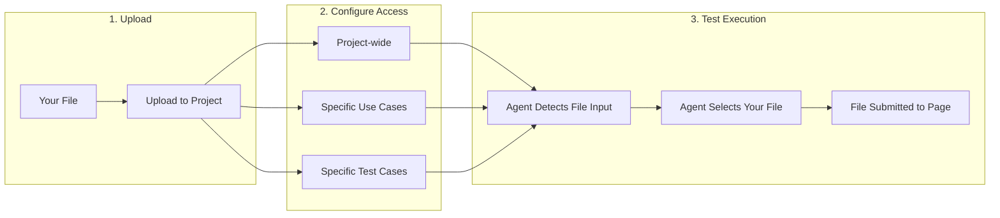

# Workflow Files

Muggle Test allows you to upload files that your tests can use during execution. This is essential when testing features that require file uploads, such as profile picture uploads, document submissions, or import functionality.

## Overview

| Phase | What Happens |
| :---- | :----------- |
| **Upload** | You provide files (images, documents, etc.) to your project |
| **Configure Access** | You specify which tests can use each file |
| **Test Execution** | The AI agent automatically uses your files when it encounters file inputs |

## When to Use Workflow Files

Upload workflow files when your application has features that require file uploads:

| Use Case | Example |
| :------- | :------ |
| **Profile pictures** | Testing avatar upload functionality |
| **Document uploads** | Submitting resumes, PDFs, or reports |
| **Import features** | CSV imports, data file uploads |
| **Media uploads** | Image galleries, video uploads |
| **Form attachments** | Support tickets with attachments |

## Supported File Types

Muggle Test supports common file formats:

| Category | Formats |
| :------- | :------ |
| **Images** | JPG, PNG, GIF, WebP, SVG |
| **Documents** | PDF, DOC, DOCX, TXT, CSV, XLS, XLSX |
| **Archives** | ZIP |
| **Other** | Most common MIME types |

| Limit | Value |
| :---- | :---- |
| Maximum file size | 10 MB per file |
| Files per project | Unlimited |

## How to Upload Files

### From the Project Dashboard

1. Open your project in the Muggle Test dashboard
2. Navigate to the **Files** tab (or click the **Files** button)
3. Click **Upload** to open the upload dialog
4. Drag and drop files or click to browse
5. Add a **description** explaining what the file is for
6. Optionally add **tags** for organization
7. Configure **file access** to specify which tests can use the file

### During Upload: File Access Configuration

When uploading, you choose which tests can access the file:

| Access Level | Description |
| :----------- | :---------- |
| **Project-wide** | All tests in the project can use this file |
| **Specific Use Cases** | Only tests within selected use cases can use this file |
| **Specific Test Cases** | Only selected individual test cases can use this file |

### Best Practices for File Descriptions

| Do | Don't |
| :- | :---- |
| Describe the file's purpose clearly | Leave description empty |
| Mention the file type and content | Use vague descriptions |
| Include context for how it should be used | Assume the agent knows what it's for |

**Good description examples:**

- "Sample resume PDF for job application upload test"
- "Valid 200x200 PNG avatar image for profile picture test"
- "CSV file with 100 product records for bulk import test"

## Managing File Access

You can change which tests have access to a file at any time.

### Editing File Access

1. Go to the **Files** tab in your project
2. Click on a file to select it
3. The **File Access** panel appears on the right
4. Check or uncheck use cases and test cases
5. Click **Save Access** to apply changes

### Understanding the Selection Hierarchy

| Selection | Effect |
| :-------- | :----- |
| **Use Case selected** | All test cases under that use case inherit access |
| **Individual Test Case selected** | Only that specific test case has access |
| **Mixed selection** | Use case shows partial indicator; only checked test cases have access |

## How Files Are Used During Test Execution

When the AI agent runs your tests, it automatically handles file uploads:

```mermaid
sequenceDiagram
    participant Agent as AI Agent
    participant Page as Web Page
    participant Files as Workflow Files
    
    Agent->>Page: Navigates to page with file input
    Agent->>Agent: Detects <input type="file">
    Agent->>Files: Checks available files for this test
    Files-->>Agent: Returns matching file
    Agent->>Page: Selects file using FileSelectAction
    Page-->>Agent: File attached to form
    Agent->>Page: Continues with form submission
```

### What the Agent Sees

During test execution, the agent receives information about available files:

| Information | Purpose |
| :---------- | :------ |
| **Filename** | Identifies the file |
| **Description** | Helps agent understand when to use it |
| **File type** | Ensures compatibility with input requirements |
| **Tags** | Additional context for file selection |

### Automatic File Selection

The AI agent uses your file descriptions to intelligently select the right file:

| Scenario | Agent Behavior |
| :------- | :------------- |
| Single file available | Uses that file for the input |
| Multiple files available | Selects based on description match and file type |
| No matching file | Reports the issue and halts for intervention |

## File Organization Tips

### Using Tags

Tags help organize files and provide context to the agent:

| Tag Strategy | Example Tags |
| :----------- | :----------- |
| **By file type** | `image`, `document`, `csv` |
| **By test scenario** | `valid-input`, `invalid-input`, `edge-case` |
| **By feature** | `profile`, `import`, `attachment` |

### Naming Conventions

| Tip | Example |
| :-- | :------ |
| Use descriptive filenames | `valid-resume-2024.pdf` instead of `doc1.pdf` |
| Include test context | `oversized-image-5mb.png` for size limit tests |
| Version when needed | `product-import-v2.csv` |

## Testing File Upload Scenarios

### Happy Path Testing

| Test | File to Upload |
| :--- | :------------- |
| Valid profile picture | Standard JPG under size limit |
| Document submission | Clean PDF with expected content |
| Data import | Well-formatted CSV with valid data |

### Edge Case Testing

| Test | File to Upload |
| :--- | :------------- |
| Size limit validation | File just under and just over the limit |
| Format validation | Wrong file extension (e.g., `.txt` renamed to `.pdf`) |
| Empty file handling | Zero-byte file |
| Special characters | Filename with spaces and unicode |

## Troubleshooting

### Common Issues

| Issue | Solution |
| :---- | :------- |
| File not appearing in test | Check file access settings for that test case |
| Wrong file selected | Improve file description to be more specific |
| Upload fails | Verify file is under 10 MB and format is supported |
| Agent can't find file input | Ensure the input element is visible and not hidden |

### File Access Not Working

If your test can't access an uploaded file:

1. Verify the file is uploaded to the correct project
2. Check that the test case has file access configured
3. Confirm the file isn't restricted to a different use case
4. Review the file description for clarity

## Next Steps

| Goal | Resource |
| :--- | :------- |
| Create your first test | [Quickstart: Running Tests](getting-started/quickstart-running-tests.md) |
| Understand test execution | [How Muggle Test Works](concepts/how-muggle-test-works.md) |
| Run tests via API | [Running Tests via API](api/running-tests-via-api.md) |
