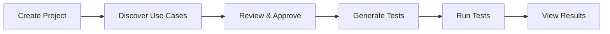

# MCP Quickstart

Connect your AI assistant to Muggle Test in under 5 minutes.

> **Note**: This guide uses the hosted MCP gateway. For local installation (lower latency, offline use), see [MCP Installation](../mcp/mcp-installation.md).

## Prerequisites

| Requirement         | Description                                                        |
| :------------------ | :----------------------------------------------------------------- |
| Muggle Test account | Active subscription required                                       |
| API key             | From your [Dashboard](https://app.muggle-ai.com/settings/api-keys) |
| MCP client          | Claude Desktop, Cursor, or any MCP-compatible client               |

## Step 1: Get Your API Key

1. Log in to your [Muggle Test Dashboard](https://app.muggle-ai.com)
2. Navigate to **Settings** → **API Keys**
3. Click **Create API Key**
4. Copy and securely store your key (format: `mai_sk_...`)

> **Important**: Keep your API key secure. Never commit it to version control or share it publicly.

## Step 2: Configure Your MCP Client

### Claude Desktop

Add the following to your Claude Desktop configuration:

```json
{
  "mcpServers": {
    "muggle-test": {
      "url": "https://mcp.muggle-ai.com/mcp",
      "headers": {
        "x-api-key": "YOUR_API_KEY_HERE"
      }
    }
  }
}
```

**Config file location:**

| Platform | Path                                                              |
| :------- | :---------------------------------------------------------------- |
| macOS    | `~/Library/Application Support/Claude/claude_desktop_config.json` |
| Windows  | `%APPDATA%\Claude\claude_desktop_config.json`                     |

### Cursor IDE

Add to your Cursor MCP settings (Settings → MCP):

```json
{
  "mcp": {
    "servers": {
      "muggle-test": {
        "url": "https://mcp.muggle-ai.com/mcp",
        "headers": {
          "x-api-key": "YOUR_API_KEY_HERE"
        }
      }
    }
  }
}
```

### Other MCP Clients

| Setting            | Value                            |
| :----------------- | :------------------------------- |
| **Endpoint**       | `https://mcp.muggle-ai.com/mcp`  |
| **Transport**      | Streamable HTTP                  |
| **Authentication** | Header `x-api-key: YOUR_API_KEY` |

## Step 3: Run Your First Test

Once connected, interact with Muggle Test through natural language:



### Create a Project

> "Create a new QA project called 'My Website Tests' for testing https://example.com"

### Discover Use Cases

You can discover use cases in two ways:

**Option A: Website Scan**

> "Scan https://example.com and discover potential test use cases"

This crawls your site and identifies testable user flows.

**Option B: Upload PRD**

> "Upload my requirements document and extract use cases from it"

Upload a PDF, Word doc, or text file containing your product requirements.

### Review and Approve

> "Show me the discovered use case candidates"

Review the candidates with their screenshots and descriptions, then:

> "Approve the login flow and checkout flow use cases"

### Generate and Run Tests

> "Generate test cases and scripts for the approved use cases, then run all tests"

### View Results

> "Show me the test results summary"

Or generate a full report:

> "Generate a test report and send it to team@example.com"

## Example Conversation

Here's a complete example:

---

**You**: I want to set up automated testing for my e-commerce site at https://shop.example.com

**Assistant**: I'll help you set up automated testing. Let me create a project first.

*[Creates project]*

Done! I've created a project called "shop.example.com Tests". Now let me scan your website to discover testable user flows.

*[Starts website scan]*

The scan is running. This usually takes a few minutes depending on your site's size.

---

**You**: What use cases did you find?

**Assistant**: I found 5 potential use cases:

|   #   | Use Case              | Description                 |
| :---: | :-------------------- | :-------------------------- |
|   1   | **User Registration** | New user signup flow        |
|   2   | **User Login**        | Authentication flow         |
|   3   | **Product Search**    | Search and filter products  |
|   4   | **Add to Cart**       | Shopping cart functionality |
|   5   | **Checkout**          | Complete purchase flow      |

Each has screenshots and notes. Would you like to approve any of these?

---

**You**: Approve all of them and generate tests

**Assistant**: Done! I've created 12 test cases across the 5 use cases, and generated executable test scripts for each. Would you like me to run them now?

---

**You**: Yes, run all tests

**Assistant**: Tests are running...

*[After completion]*

| Result   | Count |
| :------- | ----: |
| ✅ Passed |    10 |
| ❌ Failed |     2 |

Failed tests: Checkout flow - payment validation

Would you like to see the detailed report?

---

## Troubleshooting

### Connection Issues

If your MCP client can't connect:

| Check                 | Solution                                |
| :-------------------- | :-------------------------------------- |
| API key correct?      | Verify key matches dashboard            |
| Endpoint URL correct? | Must be `https://mcp.muggle-ai.com/mcp` |
| Firewall blocking?    | Allow outbound HTTPS                    |
| Config updated?       | Restart MCP client after changes        |

### Authentication Errors

If you see "UNAUTHORIZED" errors:

| Check                | Solution                    |
| :------------------- | :-------------------------- |
| Key expired?         | Regenerate in dashboard     |
| Subscription active? | Check subscription status   |
| Key format correct?  | Should start with `mai_sk_` |

### Timeout Errors

Long-running operations (website scans, test runs) may take several minutes:

| Situation             | Solution                             |
| :-------------------- | :----------------------------------- |
| Operation in progress | Wait for completion                  |
| Need status update    | Ask "What's the status of the scan?" |
| Very large site       | Consider testing sections separately |

## Alternative: Local Installation

For lower latency or offline development, you can run the gateway locally:

```bash
npm install -g @muggleai/mcp-qa-gateway
```

Then configure your MCP client to spawn it as a subprocess:

```json
{
  "mcpServers": {
    "muggle-test": {
      "command": "npx",
      "args": ["@muggleai/mcp-qa-gateway", "--stdio"],
      "env": {
        "PROMPT_SERVICE_BASE_URL": "https://promptservice.muggle-ai.com",
        "MCP_API_KEY": "YOUR_API_KEY_HERE"
      }
    }
  }
}
```

See [MCP Installation](../mcp/mcp-installation.md) for full details.

## Next Steps

- **[MCP Installation](../mcp/mcp-installation.md)** - Local vs hosted deployment
- **[MCP Concepts](../mcp/mcp-concepts.md)** - Understand the architecture
- **[MCP API Reference](../mcp/mcp-api-reference.md)** - Complete tool documentation
- **[CI/CD Integration](../mcp/mcp-cicd-integration.md)** - Automate in your pipeline
