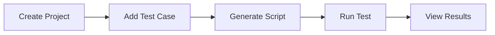

# MCP Quickstart

Connect your AI assistant to Muggle Test in under 5 minutes.

## Prerequisites

| Requirement | Description |
| :---------- | :---------- |
| Node.js | Version 22 or later |
| MCP client | Cursor IDE, Claude Desktop, or any MCP-compatible client |

## Quick Start

### Step 1: Install

```bash
npm install -g @muggleai/mcp@latest
```

### Step 2: Configure

**Cursor IDE** - Edit `~/.cursor/mcp.json`:

```json
{
  "mcpServers": {
    "muggle-test": {
      "command": "muggle-mcp",
      "args": ["serve"]
    }
  }
}
```

**Claude Desktop** - Edit your config file:

| Platform | Path |
| :------- | :--- |
| macOS | `~/Library/Application Support/Claude/claude_desktop_config.json` |
| Windows | `%APPDATA%\Claude\claude_desktop_config.json` |

```json
{
  "mcpServers": {
    "muggle-test": {
      "command": "muggle-mcp",
      "args": ["serve"]
    }
  }
}
```

### Step 3: Restart

Restart your MCP client (Cursor or Claude Desktop).

### Step 4: Verify

Ask your assistant: **"Check the Muggle Test status"**

---

## Authentication (Optional for Local Testing)

For **local testing only**, no authentication is needed. For **cloud features**, authenticate:

### Option A: Agentic Authentication (Recommended)

Ask your assistant: **"Help me log in to Muggle Test"**

The assistant will:
1. Generate a login URL and code
2. Wait for you to complete browser login
3. Store credentials locally

### Option B: API Key

1. Log in to [Muggle Test Dashboard](https://app.muggle-ai.com)
2. Navigate to **Settings** → **API Keys**
3. Create and copy your API key
4. Update your config:

```json
{
  "mcpServers": {
    "muggle-test": {
      "command": "muggle-mcp",
      "args": ["serve"],
      "env": {
        "MCP_API_KEY": "mai_sk_your_api_key_here"
      }
    }
  }
}
```

---

## Run Your First Test

### Local Testing (localhost)


```mermaid
flowchart LR
    A["Create Project"] --> B["Add Test Case"]
    B --> C["Generate Script"]
    C --> D["Run Test"]
    D --> E["View Results"]
```

**1. Create a project:**

> "Create a test project for my app at http://localhost:3000"

**2. Add a test case:**

> "Create a test case to verify the login form shows an error for invalid email"

**3. Generate a test script:**

> "Generate a test script for the login test case"

**4. Run the test:**

> "Run the login test"

### Cloud QA Testing (remote URLs)

For testing staging, preview, or production URLs:

**1. Create a project:**

> "Create a QA project called 'My Website Tests' for testing https://example.com"

**2. Discover use cases:**

> "Scan the website and discover potential test use cases"

**3. Review and approve:**

> "Show me the discovered use case candidates"
> "Approve the login and checkout use cases"

**4. Generate and run tests:**

> "Generate test cases for the approved use cases, then run all tests"

**5. View results:**

> "Show me the test results summary"

---

## Example Conversation

**You**: I want to test my app running at localhost:3000

**Assistant**: I'll help you set up testing. Let me create a project first.

*[Creates project]*

Done! I've created a project called "localhost:3000 Tests". What would you like to test?

---

**You**: Test that the signup form validates email format

**Assistant**: I'll create a test case for email validation.

*[Creates test case]*

Created! Now I'll generate a test script by automating the browser.

*[Launches browser, performs test steps, captures screenshots]*

Test script generated successfully! The test navigated to the signup page, entered an invalid email, and verified the error message appeared.

Would you like me to run the test now?

---

**You**: Yes, run it

**Assistant**: Running the test...

*[Executes test script]*

**Result: PASSED** (2.3s)

The signup form correctly shows "Please enter a valid email" when an invalid email is submitted.

---

## Tool Overview

| Category | Tools | Purpose |
| :------- | :---- | :------ |
| **Local Testing** | `muggle-local-project-*`, `muggle-local-use-case-*`, `muggle-local-test-case-*` | Manage local test projects |
| **Execution** | `muggle-local-execute-*` | Generate and run test scripts |
| **Cloud QA** | `muggle-remote-project-*`, `muggle-remote-workflow-*` | Cloud-based testing workflows |
| **Publishing** | `muggle-local-publish-*`, `muggle-local-cloud-*` | Sync between local and cloud |

**Total: 120+ tools** covering both local and cloud testing.

---

## Choosing Local vs Cloud

| Scenario | Recommendation |
| :------- | :------------- |
| Testing during development | **Local** (`muggle-mcp serve --local`) |
| Testing localhost URLs | **Local** |
| Testing preview/staging deployments | **Cloud** (`muggle-mcp serve --qa`) |
| CI/CD integration | **Cloud** |
| Team collaboration | **Cloud** |
| Both local and cloud | **Default** (`muggle-mcp serve`) |

---

## Hosted Gateway (Alternative)

For cloud-only testing without local installation, use the hosted gateway:

```json
{
  "mcpServers": {
    "muggle-test": {
      "url": "https://mcp.muggle-ai.com/mcp",
      "headers": {
        "x-api-key": "mai_sk_your_api_key_here"
      }
    }
  }
}
```

---

## Troubleshooting

### Connection Issues

| Check | Solution |
| :---- | :------- |
| Package installed? | `npm list -g @muggleai/mcp` |
| Config correct? | Verify JSON syntax |
| Client restarted? | Restart after config changes |
| Run doctor? | `muggle-mcp doctor` |

### Authentication Errors

| Check | Solution |
| :---- | :------- |
| API key correct? | Verify key in dashboard |
| Key expired? | Regenerate in dashboard |
| Key format? | Should start with `mai_sk_` |

---

## Next Steps

- **[MCP Installation](../mcp/mcp-installation.md)** - Detailed setup options
- **[Local Testing Setup](../local-testing/setup.md)** - In-depth local testing guide
- **[MCP Concepts](../mcp/mcp-concepts.md)** - Understand the architecture
- **[MCP API Reference](../mcp/mcp-api-reference.md)** - Complete tool documentation
- **[CI/CD Integration](../mcp/mcp-cicd-integration.md)** - Automate in your pipeline
