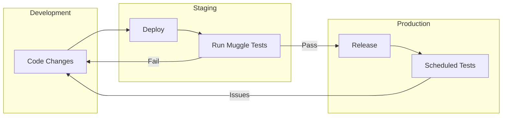

# Muggle Test Overview

Muggle Test is an AI-powered web testing platform that discovers user flows in your product and keeps them covered with executable tests.

## When to Use Muggle Test

| Scenario | Muggle Test Helps By |
|:---------|:---------------------|
| You ship changes weekly or faster | Catching regressions before they reach users |
| You don't want to maintain E2E tests by hand | Auto-generating and updating test scripts |
| You care about realistic coverage | Testing actual user journeys, not brittle selectors |

## What You Get

| Feature | Description |
|:--------|:------------|
| **Auto-discovered flows** | Login, CRUD, search, dashboards, and more |
| **Executable test scripts** | Re-run on every change |
| **Human-readable reports** | Share results with your whole team |

## How It Fits Into Your Workflow

| Stage | How Muggle Test Helps |
|:------|:----------------------|
| **Before release** | Run tests against staging to catch regressions |
| **After release** | Schedule regular runs to verify critical flows |
| **During development** | Quickly verify new features don't break existing journeys |
