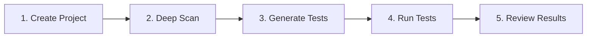

# Quickstart: Running Your First Tests

This guide walks you from zero to your first successful test run in a few minutes.

## Overview

## Step 1: Create a Project

1. Go to **Dashboard → Projects → New Project**
2. Enter the **base URL** of the environment you want to test
3. Optionally add **login credentials** for authenticated flows

### Recommendations

| Setting           | Recommendation                                        |
| :---------------- | :---------------------------------------------------- |
| **Environment**   | Use a stable staging environment                      |
| **2FA / CAPTCHA** | Disable on test environment for reliable automation   |
| **Test account**  | Create a dedicated account with necessary permissions |

## Step 2: Add Use Cases

You have two options to populate your project with test scenarios:

### Option A: Deep Scan (Automatic Discovery)

Start a **Deep Scan** to let the AI agent explore your site and discover key user flows.

| Flow Type        | Examples                           |
| :--------------- | :--------------------------------- |
| Authentication   | Login, logout, password reset      |
| CRUD operations  | Create, read, update, delete items |
| Search & filters | Search bars, faceted navigation    |
| Dashboards       | Analytics, reports, admin panels   |

### Option B: Upload PRD (From Documentation)

If you have existing requirements documents, upload them to extract test scenarios automatically.

1. Click **Add Use Cases from PRD**
2. Upload your PRD file (TXT, PDF, DOC, or DOCX)
3. Wait for AI to extract scenarios
4. Review and approve the generated use cases

| When to Use PRD Upload | Benefit |
| :--------------------- | :------ |
| You have detailed requirements docs | Faster than manual entry |
| Testing specific features | Focused test coverage |
| Onboarding a new project | Leverage existing documentation |

See [Uploading PRD Files](../concepts/prd-upload.md) for detailed guidance.

### Managing Discovered Flows

| Action         | When to Use                        |
| :------------- | :--------------------------------- |
| **Rename**     | Match your domain language         |
| **Disable**    | Exclude flows you don't care about |
| **Prioritize** | Mark critical business flows       |

## Step 3: Generate and Run Tests

1. Select the flows you care about most
2. Click **Generate Tests**
3. When scripts are ready, click **Run All**

### What Happens During a Run

| Step          | Description                                 |
| :------------ | :------------------------------------------ |
| Browser opens | Real browser environment launches           |
| Steps execute | Each action in the script runs sequentially |
| Validation    | Assertions check expected outcomes          |
| Capture       | Screenshots and logs saved for debugging    |

## Step 4: Review Results

Once runs complete, open the **Report** tab for your project.

### Filtering Results

| Filter         | Use Case                         |
| :------------- | :------------------------------- |
| **Status**     | Show only passed or failed tests |
| **Flow name**  | Focus on specific user journeys  |
| **Date range** | Compare results over time        |

### Investigating Failures

For each failing step, you can see:

| Information       | Purpose                         |
| :---------------- | :------------------------------ |
| **Action**        | Exact step that failed          |
| **Screenshot**    | Visual state at failure time    |
| **Error message** | Technical details for debugging |
| **Page URL**      | Where the failure occurred      |

## Next Steps

| Goal                        | Resource                                                      |
| :-------------------------- | :------------------------------------------------------------ |
| Understand the architecture | [How Muggle Test Works](concepts/how-muggle-test-works.md)    |
| Upload requirements docs    | [Uploading PRD Files](concepts/prd-upload.md)                 |
| Test file upload features   | [Workflow Files](concepts/workflow-files.md)                  |
| Automate via API            | [Running Tests via API](api/running-tests-via-api.md)         |
| Use AI assistants           | [MCP Quickstart](getting-started/mcp-quickstart.md)           |
