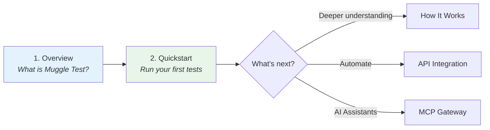

# Welcome to Muggle Test

Muggle Test is an AI-powered web testing platform that discovers realistic user flows and keeps them covered with executable tests.

This page helps you find the right documentation based on what you're trying to do.

## Quick Navigation

| If you want to...            | Start here                                                    |
| :--------------------------- | :------------------------------------------------------------ |
| Learn what Muggle Test is    | [Muggle Test Overview](./overview.md)                         |
| Get your first tests running | [Quickstart: Running Tests](./quickstart-running-tests.md)    |
| Understand the architecture  | [How Muggle Test Works](../concepts/how-muggle-test-works.md) |
| Integrate via API            | [API Overview](../api/api-overview.md)                        |
| Use AI assistants (MCP)      | [MCP Quickstart](./mcp-quickstart.md)                         |
| Fix a problem                | [Common Issues](../troubleshooting/common-issues.md)          |

## Recommended Reading Path

## Documentation Sections

| Section             | Contents                                            |
| :------------------ | :-------------------------------------------------- |
| **Getting Started** | Onboarding, quickstart guides                       |
| **Concepts**        | Architecture, how discovery and testing work        |
| **API**             | Authentication, endpoints, integration examples     |
| **MCP Gateway**     | AI assistant integration via Model Context Protocol |
| **Troubleshooting** | Common issues and solutions                         |

Use the sidebar search to jump directly to topics, or browse sections on the left.
