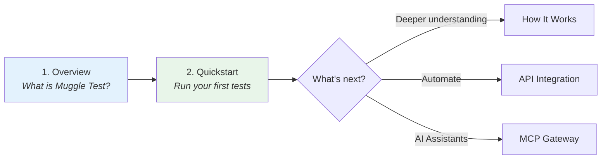

# Welcome to Muggle Test

Muggle Test is an AI-powered web testing platform that discovers realistic user flows and keeps them covered with executable tests.

This page helps you find the right documentation based on what you're trying to do.

## Quick Navigation

| If you want to...            | Start here                                                               |
| :--------------------------- | :----------------------------------------------------------------------- |
| Learn what Muggle Test is    | [Muggle Test Overview](getting-started/overview.md)                      |
| Get your first tests running | [Quickstart: Running Tests](getting-started/quickstart-running-tests.md) |
| Test localhost apps          | [Local Testing Setup](local-testing/setup.md)                            |
| Understand the architecture  | [How Muggle Test Works](concepts/how-muggle-test-works.md)               |
| Integrate via API            | [API Overview](api/api-overview.md)                                      |
| Use AI assistants (MCP)      | [MCP Quickstart](getting-started/mcp-quickstart.md)                      |
| Fix a problem                | [Common Issues](troubleshooting/common-issues.md)                        |

## Recommended Reading Path

```mermaid
flowchart LR
    A["1. Overview<br/><i>What is Muggle Test?</i>"] --> B["2. Quickstart<br/><i>Run your first tests</i>"]
    B --> C{"What's next?"}
    C -->|"Deeper understanding"| D["How It Works"]
    C -->|"Automate"| E["API Integration"]
    C -->|"AI Assistants"| F["MCP Gateway"]

    style A fill:#e3f2fd
    style B fill:#e8f5e9
```

## Documentation Sections

| Section                    | Contents                                                   |
| :------------------------- | :--------------------------------------------------------- |
| **Getting Started**        | Onboarding, quickstart guides                              |
| **Concepts**               | Architecture, how discovery and testing work               |
| **Remote Testing with MCP**| Test preview, staging, and production via AI assistants    |
| **Local Testing with MCP** | Test localhost apps directly from your AI assistant        |
| **API**                    | Authentication, endpoints, integration examples            |
| **Troubleshooting**        | Common issues and solutions                                |

Use the sidebar search to jump directly to topics, or browse sections on the left.
