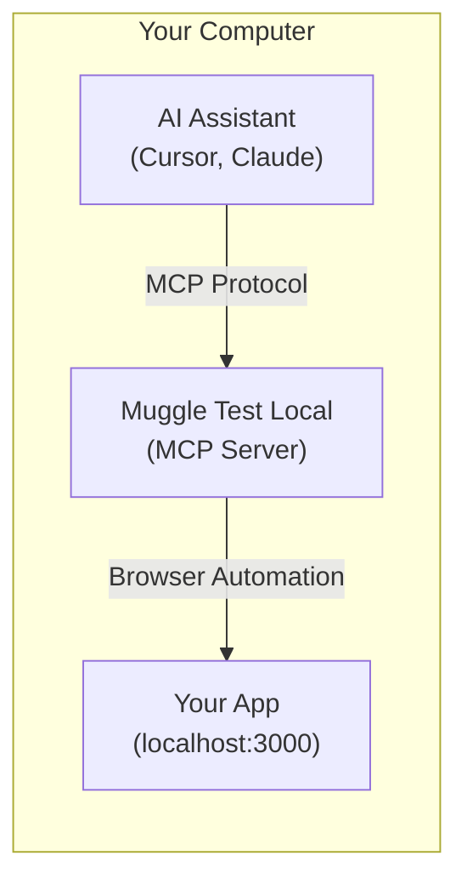
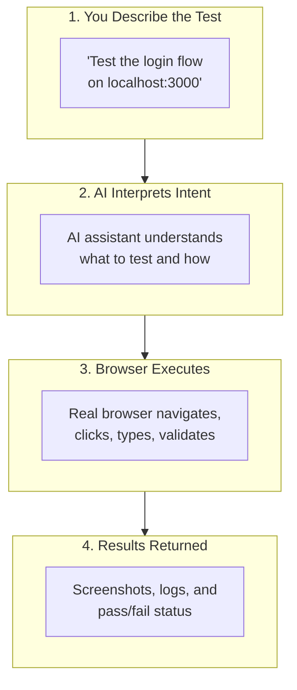
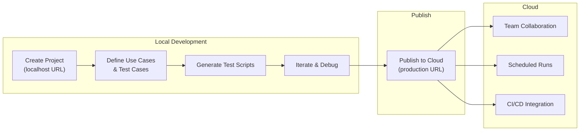

# Local Testing with MCP Overview

Test your localhost applications directly from your AI assistant using Muggle Test Local.

## What is Local Testing with MCP?

Muggle Test Local is a local MCP server that enables AI assistants like Cursor and Claude Desktop to test web applications running on your development machine. Unlike the [Remote Testing MCP Gateway](mcp/overview.md) which tests publicly accessible URLs, Local Testing runs entirely on your computer and can access `localhost` URLs.

## When to Use Local vs Remote Testing

| Environment | Example | Which to Use |
| :---------- | :------ | :----------- |
| Local development | `localhost:3000` | **Local Testing** |
| Docker containers | `localhost:8080` | **Local Testing** |
| Local network | `192.168.1.x` | **Local Testing** |
| Preview deployments | `pr-123.preview.example.com` | [Remote Testing](mcp/overview.md) |
| Staging | `staging.example.com` | [Remote Testing](mcp/overview.md) |
| Production | `www.example.com` | [Remote Testing](mcp/overview.md) |

## Why Local Testing?

| Challenge | Solution |
| :-------- | :------- |
| Cloud services can't access localhost | Runs entirely on your machine |
| Context switching between IDE and browser | Test directly from your coding assistant |
| Manual testing slows development | AI-driven test automation |
| Hard to describe bugs to teammates | Screenshots and test results captured automatically |

## Key Features

| Feature | Description |
| :------ | :---------- |
| **Localhost Access** | Test `localhost`, `127.0.0.1`, or any local dev server |
| **AI-Driven Testing** | Describe tests in natural language |
| **Project Organization** | Manage projects, use cases, and test cases locally |
| **Test Script Generation** | AI generates repeatable test scripts from test cases |
| **Browser Automation** | Real browser interactions (click, type, scroll) |
| **Screenshot Capture** | Visual documentation of test results |
| **Agent Skills** | Pre-built workflows like "test my changes" with smart change detection |
| **Publish to Cloud** | Sync local projects to Muggle AI for team collaboration |

## How It Works

1. **You describe what to test** in natural language to your AI assistant
2. **The assistant translates** your request into browser automation commands
3. **A real browser** (Electron/Chromium) executes the actions on your localhost app
4. **Results come back** with screenshots, logs, and status—all in your IDE

## Comparison: Local vs Remote Testing

| Aspect | Local Testing | Remote Testing (MCP Gateway) |
| :----- | :------------ | :--------------------------- |
| **Target URLs** | `localhost`, local network | Public URLs (preview, staging, prod) |
| **Setup** | Install local packages | Just configure API key |
| **Browser runs on** | Your machine | Muggle AI cloud |
| **Test results** | Local files (`~/.muggle-ai/`) | Cloud dashboard |
| **Best for** | Development, debugging | CI/CD, production testing |
| **Subscription** | Free (local only) | Requires plan |

## When to Use Each

| Scenario | Recommendation |
| :------- | :------------- |
| Testing during local development | **Local Testing** |
| Debugging a specific bug locally | **Local Testing** |
| Testing before committing code | **Local Testing** |
| Testing preview/PR deployments | [Remote Testing](mcp/overview.md) |
| Automated CI/CD testing | [Remote Testing](mcp/overview.md) |
| Testing staging or production | [Remote Testing](mcp/overview.md) |
| Team collaboration on test results | [Remote Testing](mcp/overview.md) |

## Quick Example

Here's what local testing looks like in practice:

---

**You**: Test the signup form on my local app at localhost:3000/signup. Try submitting with an invalid email and verify the error message appears.

**Assistant**: I'll test the signup form validation on your local app.

*[Runs test against localhost:3000/signup]*

Test completed:
- Navigated to localhost:3000/signup
- Entered "invalid-email" in the email field
- Clicked Submit
- **Result**: Error message "Please enter a valid email" appeared ✓

Screenshot saved to `~/.muggle-ai/sessions/session-xxx/screenshots/step-003.png`

---

## Local-to-Production Workflow

Local Testing supports a workflow that takes you from development to production:

1. **Develop locally** — Create projects with localhost URLs, define test cases
2. **Generate scripts** — AI creates test scripts by interacting with your app
3. **Iterate** — Refine test cases as your app evolves
4. **Publish** — When ready, publish to cloud with production URLs
5. **Scale** — Cloud enables team collaboration and automated testing

## Getting Started

Ready to test your localhost applications?

1. **[Local Testing Setup](setup.md)** — Install and configure in 10 minutes
2. **[Agent Skills](skills.md)** — Pre-built workflows for "test my changes" and "publish to cloud"
3. **[Available Tools](tools-reference.md)** — Complete tool documentation
4. **[Example Workflows](examples.md)** — Common testing scenarios

## Requirements

| Requirement | Version |
| :---------- | :------ |
| Node.js | 22 or later |
| MCP Client | Cursor, Claude Desktop, or compatible |
| Operating System | macOS, Windows, or Linux |
