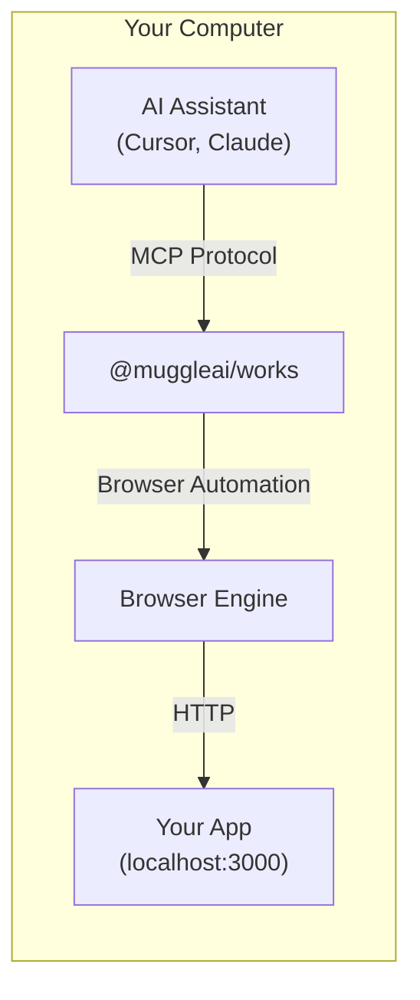
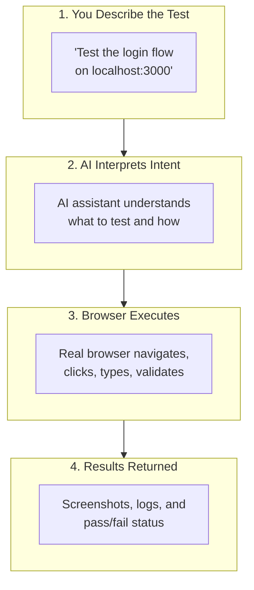
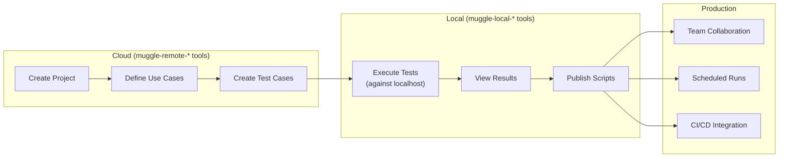

# Local Testing Overview

Test your localhost applications directly from your AI assistant using Muggle Test.

## What is Local Testing?

Local Testing is a capability of the `@muggleai/works` package that enables AI assistants like Cursor and Claude Desktop to test web applications running on your development machine. Unlike cloud QA which tests publicly accessible URLs, local testing runs entirely on your computer and can access `localhost` URLs.

## When to Use Local vs Cloud Testing

| Environment | Example | Which to Use |
| :---------- | :------ | :----------- |
| Local development | `localhost:3000` | **Local Testing** |
| Docker containers | `localhost:8080` | **Local Testing** |
| Local network | `192.168.1.x` | **Local Testing** |
| Preview deployments | `pr-123.preview.example.com` | Cloud QA |
| Staging | `staging.example.com` | Cloud QA |
| Production | `www.example.com` | Cloud QA |

## Why Local Testing?

| Challenge | Solution |
| :-------- | :------- |
| Cloud services can't access localhost | Runs entirely on your machine |
| Context switching between IDE and browser | Test directly from your coding assistant |
| Manual testing slows development | AI-driven test automation |
| Hard to describe bugs to teammates | Screenshots and test results captured automatically |

## Key Features

| Feature | Description |
| :------ | :---------- |
| **Localhost Access** | Test `localhost`, `127.0.0.1`, or any local dev server |
| **AI-Driven Testing** | Describe tests in natural language |
| **Cloud-First Architecture** | Manage entities in cloud (`muggle-remote-*`), execute locally (`muggle-local-*`) |
| **Test Script Generation** | AI generates repeatable test scripts from test cases |
| **Browser Automation** | Real browser interactions (click, type, scroll) |
| **Screenshot Capture** | Visual documentation of test results |
| **Agent Skills** | Pre-built workflows like "test my changes" |
| **Publish Test to Cloud** | Upload locally generated test scripts to Muggle Test for replay and collaboration |

## How It Works

1. **You describe what to test** in natural language to your AI assistant
2. **The assistant translates** your request into browser automation commands
3. **A real browser** (Electron/Chromium) executes the actions on your localhost app
4. **Results come back** with screenshots, logs, and status—all in your IDE

## Comparison: Local vs Cloud Testing

| Aspect | Local Testing | Cloud QA |
| :----- | :------------ | :------- |
| **Target URLs** | `localhost`, local network | Public URLs (preview, staging, prod) |
| **Setup** | `muggle serve --local` | `muggle serve --qa` |
| **Browser runs on** | Your machine | Muggle AI cloud |
| **Test results** | Local files (`~/.muggle-ai/`) | Cloud dashboard |
| **Best for** | Development, debugging | CI/CD, production testing |
| **Subscription** | Free (local only) | Requires plan |

## When to Use Each

| Scenario | Recommendation |
| :------- | :------------- |
| Testing during local development | **Local Testing** |
| Debugging a specific bug locally | **Local Testing** |
| Testing before committing code | **Local Testing** |
| Testing preview/PR deployments | Cloud QA |
| Automated CI/CD testing | Cloud QA |
| Testing staging or production | Cloud QA |
| Team collaboration on test results | Cloud QA |

## Quick Example

Here's what local testing looks like in practice:

---

**You**: Test the signup form on my local app at localhost:3000/signup. Try submitting with an invalid email and verify the error message appears.

**Assistant**: I'll test the signup form validation on your local app.

*[Runs test against localhost:3000/signup]*

Test completed:
- Navigated to localhost:3000/signup
- Entered "invalid-email" in the email field
- Clicked Submit
- **Result**: Error message "Please enter a valid email" appeared ✓

Screenshot saved to `~/.muggle-ai/sessions/session-xxx/screenshots/step-003.png`

---

## Cloud-First Local Testing Workflow

Local Testing uses a **cloud-first architecture**:

- **`muggle-remote-*` tools**: All entity management (projects, use cases, test cases) happens in the cloud
- **`muggle-local-*` tools**: Local execution, results viewing, and publishing only

1. **Create in cloud** — Use `muggle-remote-*` tools to create projects, use cases, and test cases
2. **Fetch details** — Call `muggle-remote-test-case-get` to retrieve test case information
3. **Execute locally** — Use `muggle-local-execute-test-generation` with localhost URL
4. **View results** — Use `muggle-local-run-result-get` to see screenshots and status
5. **Publish** — Use `muggle-local-publish-test-script` to upload generated scripts
6. **Scale** — Cloud enables team collaboration and CI/CD integration

## Getting Started

Ready to test your localhost applications?

1. **[Local Testing Setup](setup.md)** — Install and configure in 10 minutes
2. **[Agent Skills](skills.md)** — Pre-built workflows for "test my changes" and "publish test to cloud"
3. **[Available Tools](tools-reference.md)** — Complete tool documentation
4. **[Example Workflows](examples.md)** — Common testing scenarios

## Requirements

| Requirement | Version |
| :---------- | :------ |
| Node.js | 22 or later |
| MCP Client | Cursor, Claude Desktop, or compatible |
| Operating System | macOS, Windows, or Linux |
