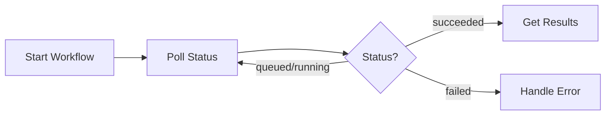

# MCP API Reference

Complete reference for all MCP Gateway tools.

## Overview

The MCP Gateway exposes tools organized into these categories:

| Category | Count | Purpose | Link |
|:---------|------:|:--------|:-----|
| Project | 4 | Create and manage testing projects | [Jump](#project-tools) |
| PRD Files | 3 | Upload requirements documents | [Jump](#prd-file-tools) |
| Secrets | 5 | Manage test credentials | [Jump](#secret-tools) |
| Use Cases | 4 | Discover and approve use cases | [Jump](#use-case-tools) |
| Workflows | 17 | Execute testing workflows | [Jump](#workflow-tools) |
| Artifacts | 9 | Inspect test cases and scripts | [Jump](#artifact-tools) |
| Reports | 4 | Generate and deliver reports | [Jump](#report-tools) |
| Recommendations | 2 | Get scheduling guidance | [Jump](#recommendation-tools) |

---

## Project Tools

### qa_project_create

Create a new QA testing project.

**Input:**

```json
{
  "projectName": "My Website Tests",
  "description": "End-to-end tests for example.com",
  "url": "https://example.com",
  "testRequirements": "Test login, checkout, and search flows"
}
```

| Field | Type | Required | Description |
|:------|:-----|:--------:|:------------|
| `projectName` | string | ✓ | Name of the project (max 255 chars) |
| `description` | string | | Project description |
| `url` | string | | Target website URL |
| `testRequirements` | string | | Testing scope and requirements |

**Output:**

```json
{
  "projectId": "proj_abc123",
  "projectName": "My Website Tests",
  "createdAt": "2024-01-15T10:30:00Z"
}
```

### qa_project_get

Get details of a specific project by ID.

| Field | Type | Required | Description |
|:------|:-----|:--------:|:------------|
| `projectId` | string | ✓ | Project ID to retrieve |

### qa_project_update

Update an existing project's details.

| Field | Type | Required | Description |
|:------|:-----|:--------:|:------------|
| `projectId` | string | ✓ | Project ID to update |
| `projectName` | string | | New project name |
| `description` | string | | Updated description |
| `url` | string | | Updated target URL |

### qa_project_list

List all projects accessible to you with pagination.

| Field | Type | Required | Default | Description |
|:------|:-----|:--------:|:--------|:------------|
| `page` | number | | 1 | Page number |
| `pageSize` | number | | 20 | Items per page (max 100) |

---

## PRD File Tools

### qa_prd_file_upload

Upload a Product Requirements Document to help AI generate accurate use cases.

**Input:**

```json
{
  "projectId": "proj_abc123",
  "fileName": "requirements.pdf",
  "contentBase64": "JVBERi0xLjQKJ...",
  "contentType": "application/pdf"
}
```

| Field | Type | Required | Description |
|:------|:-----|:--------:|:------------|
| `projectId` | string | ✓ | Project to associate the file with |
| `fileName` | string | ✓ | Name of the file |
| `contentBase64` | string | ✓ | Base64-encoded file content |
| `contentType` | string | | MIME type (default: `application/octet-stream`) |

**Supported formats:**

| Format | Extension | MIME Type |
|:-------|:----------|:----------|
| PDF | `.pdf` | `application/pdf` |
| Word | `.docx` | `application/vnd.openxmlformats-officedocument.wordprocessingml.document` |
| Text | `.txt` | `text/plain` |
| Markdown | `.md` | `text/markdown` |

### qa_prd_file_list_by_project

List all PRD files for a project.

### qa_prd_file_delete

Delete a PRD file.

---

## Secret Tools

Secrets store credentials needed for testing. Values are encrypted and **never returned** in responses.

### qa_secret_create

Create a new secret.

**Input:**

```json
{
  "projectId": "proj_abc123",
  "name": "TEST_USER_PASSWORD",
  "value": "secretpassword123",
  "description": "Password for test user account"
}
```

| Field | Type | Required | Description |
|:------|:-----|:--------:|:------------|
| `projectId` | string | ✓ | Project to create secret for |
| `name` | string | ✓ | Secret name/key |
| `value` | string | ✓ | Secret value (encrypted at rest) |
| `description` | string | | Description of the secret |

### qa_secret_list

List all secrets for a project.

> **Note:** Secret values are never returned in list responses.

### qa_secret_get

Get secret metadata (value is not returned).

### qa_secret_update

Update a secret's name, value, or description.

### qa_secret_delete

Delete a secret.

---

## Use Case Tools

### qa_use_case_discovery_memory_get

Get discovered use case candidates with evidence (screenshots, notes).

**Output:**

```json
{
  "projectId": "proj_abc123",
  "useCaseCandidates": [
    {
      "id": "cand_001",
      "status": "candidate",
      "useCase": {
        "title": "User Login",
        "description": "Authenticate user with email and password"
      },
      "comments": [
        {
          "pageUrl": "https://example.com/login",
          "screenshotUrl": "https://storage.muggle-ai.com/screenshots/...",
          "notes": "Found login form with email and password fields"
        }
      ]
    }
  ]
}
```

**Candidate statuses:**

| Status | Description |
|:-------|:------------|
| `draft` | Initial discovery, not yet evaluated |
| `candidate` | Evaluated and ready for review |
| `graduated` | Approved and promoted to use case |
| `dropped` | Rejected and archived |

### qa_use_case_candidates_approve

Approve (graduate) selected candidates into active use cases.

**Input:**

```json
{
  "projectId": "proj_abc123",
  "approvedCandidateIds": ["cand_001", "cand_002"]
}
```

| Field | Type | Required | Description |
|:------|:-----|:--------:|:------------|
| `projectId` | string | ✓ | Project ID |
| `approvedCandidateIds` | string[] | ✓ | IDs of candidates to approve |

### qa_use_case_list

List graduated use cases for a project.

### qa_use_case_get

Get details of a specific use case.

---

## Workflow Tools

Workflows are long-running operations. After starting, use `get_latest_run` tools to check status.



### Website Scan

#### qa_workflow_start_website_scan

Start scanning a website to discover use cases.

**Input:**

```json
{
  "projectId": "proj_abc123",
  "url": "https://example.com",
  "description": "Discover e-commerce user flows",
  "archiveUnapproved": true
}
```

| Field | Type | Required | Description |
|:------|:-----|:--------:|:------------|
| `projectId` | string | ✓ | Target project |
| `url` | string | ✓ | Website URL to scan |
| `description` | string | ✓ | What to look for |
| `archiveUnapproved` | boolean | | Archive existing unapproved candidates first |

**Output:**

```json
{
  "workflowRuntimeId": "wfrt_scan_123"
}
```

#### qa_workflow_get_website_scan_latest_run

Check scan status.

**Output:**

```json
{
  "workflowRunId": "wfrun_456",
  "status": "succeeded",
  "updatedAt": "2024-01-15T10:35:00Z"
}
```

**Workflow statuses:**

| Status | Description |
|:-------|:------------|
| `queued` | Waiting to start |
| `running` | In progress |
| `succeeded` | Completed successfully |
| `failed` | Completed with errors |
| `cancelled` | Stopped by user |

#### qa_workflow_list_website_scan_runtimes

List all website scan runtimes.

### Test Case Detection

#### qa_workflow_start_test_case_detection

Generate test cases from approved use cases.

| Field | Type | Required | Description |
|:------|:-----|:--------:|:------------|
| `projectId` | string | ✓ | Target project |
| `useCaseId` | string | | Specific use case (omit for all) |

#### qa_workflow_get_test_case_detection_latest_run

Check test case detection status.

#### qa_workflow_list_test_case_detection_runtimes

List test case detection runtimes.

### Test Script Generation

#### qa_workflow_start_test_script_generation

Generate executable test scripts from test cases.

| Field | Type | Required | Description |
|:------|:-----|:--------:|:------------|
| `projectId` | string | ✓ | Target project |
| `testCaseId` | string | | Specific test case |
| `useCaseId` | string | | Specific use case |

#### qa_workflow_get_test_script_generation_latest_run

Check script generation status.

#### qa_workflow_get_latest_test_script_generation_runtime_by_test_case

Get the latest generation runtime for a specific test case.

### Test Script Replay

#### qa_workflow_start_test_script_replay

Execute a single test script.

| Field | Type | Required | Description |
|:------|:-----|:--------:|:------------|
| `projectId` | string | ✓ | Target project |
| `testScriptId` | string | ✓ | Script to execute |

#### qa_workflow_start_test_script_replay_bulk

Execute multiple test scripts in parallel.

**Input:**

```json
{
  "projectId": "proj_abc123",
  "testScriptIds": ["ts_301", "ts_302"],
  "name": "Nightly regression"
}
```

| Field | Type | Required | Description |
|:------|:-----|:--------:|:------------|
| `projectId` | string | ✓ | Target project |
| `testScriptIds` | string[] | | Specific scripts (omit for all) |
| `name` | string | | Name for this run batch |

#### qa_workflow_get_test_script_replay_bulk_latest_run

Check bulk replay status.

#### qa_workflow_get_replay_bulk_run_batch_summary

Get detailed summary of a bulk run batch.

**Output:**

```json
{
  "runBatchId": "batch_789",
  "totalScripts": 10,
  "passed": 8,
  "failed": 2
}
```

### Workflow Management

#### qa_workflow_cancel_run

Cancel a specific workflow run.

#### qa_workflow_cancel_runtime

Cancel a workflow runtime and all its runs.

---

## Artifact Tools

### Test Cases

#### qa_test_case_list

List test cases for a project.

#### qa_test_case_get

Get test case details including steps and expected outcomes.

#### qa_test_case_list_by_use_case

List test cases for a specific use case.

### Test Scripts

#### qa_test_script_list

List test scripts for a project.

#### qa_test_script_get

Get test script details including executable steps.

#### qa_test_script_list_paginated

List test scripts with full pagination.

### Summaries

#### qa_project_test_results_summary_get

Get aggregated test results summary.

**Output:**

```json
{
  "projectId": "proj_abc123",
  "totalTests": 25,
  "passed": 22,
  "failed": 3,
  "passRate": 88.0
}
```

#### qa_project_test_scripts_summary_get

Get test scripts summary.

#### qa_project_test_runs_summary_get

Get recent test runs summary.

---

## Report Tools

### qa_report_stats_summary_get

Get report statistics and health score.

### qa_report_cost_query

Query usage and cost data.

| Field | Type | Required | Description |
|:------|:-----|:--------:|:------------|
| `projectId` | string | ✓ | Target project |
| `startDateKey` | string | | Start date (YYYYMMDD) |
| `endDateKey` | string | | End date (YYYYMMDD) |

### qa_report_preferences_upsert

Configure report delivery preferences.

**Input:**

```json
{
  "projectId": "proj_abc123",
  "channels": ["email", "webhook"],
  "emails": ["team@example.com"],
  "webhookUrl": "https://hooks.example.com/muggle"
}
```

| Field | Type | Required | Description |
|:------|:-----|:--------:|:------------|
| `projectId` | string | ✓ | Target project |
| `channels` | string[] | ✓ | Delivery channels |
| `emails` | string[] | | Email addresses (for email channel) |
| `phones` | string[] | | Phone numbers (for SMS channel) |
| `webhookUrl` | string | | Webhook endpoint (for webhook channel) |

**Available channels:**

| Channel | Description |
|:--------|:------------|
| `email` | Send reports as PDF attachments |
| `sms` | Send summary notifications |
| `webhook` | POST JSON payload to endpoint |

### qa_report_final_generate

Generate a final test report (async operation).

---

## Recommendation Tools

These tools provide guidance without making changes.

### qa_recommend_schedule

Get test scheduling recommendations.

**Output:**

```json
{
  "recommendations": [
    {
      "title": "Nightly Regression Tests",
      "rationale": "Running tests every night catches regressions quickly",
      "schedule": "0 2 * * *",
      "tradeoffs": ["Pro: Fresh results every morning", "Con: Delayed feedback"]
    }
  ]
}
```

### qa_recommend_cicd_setup

Get CI/CD integration templates for GitHub Actions, Azure DevOps, GitLab CI, etc.

| Field | Type | Options |
|:------|:-----|:--------|
| `repositoryProvider` | string | `github`, `azureDevOps`, `gitlab`, `other` |
| `cadence` | string | `onPullRequest`, `nightly`, `onDemand` |

---

## Error Responses

All tools may return errors:

```json
{
  "error": "ERROR_CODE",
  "message": "Human-readable description",
  "details": {}
}
```

| Error Code | HTTP Status | Description |
|:-----------|:-----------:|:------------|
| `UNAUTHORIZED` | 401 | Missing or invalid authentication |
| `FORBIDDEN` | 403 | Access denied to resource |
| `NOT_FOUND` | 404 | Resource doesn't exist |
| `INVALID_ARGUMENT` | 400 | Invalid input parameters |
| `UPSTREAM_ERROR` | 502 | Backend service error |
| `INTERNAL_ERROR` | 500 | Unexpected server error |

---

## Next Steps

- **[MCP Quickstart](../getting-started/mcp-quickstart.md)** - Get started
- **[MCP Concepts](./mcp-concepts.md)** - Understand the architecture
- **[CI/CD Integration](./mcp-cicd-integration.md)** - Automate in pipelines
