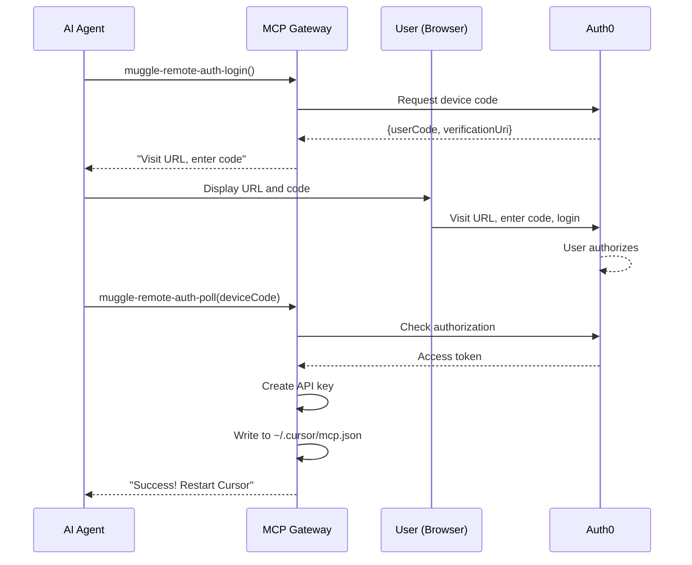
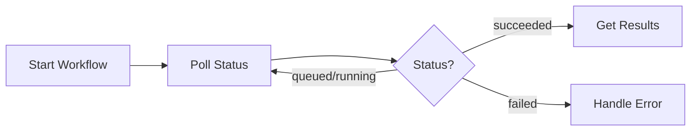

# MCP API Reference

Complete reference for cloud E2E acceptance tools in the `@muggleai/works` package.

> **Note:** This page documents cloud E2E acceptance tools (prefix: `muggle-remote-`). For local testing tools (prefix: `muggle-local-`), see [Local Testing Tools Reference](local-testing/tools-reference.md).

## On This Page

| Section | Description |
| :------ | :---------- |
| [Overview](#overview) | Tool categories at a glance |
| [Authentication Tools](#authentication-tools) | Device code flow, API key management |
| [Project Tools](#project-tools) | Create, update, list, delete projects |
| [PRD File Tools](#prd-file-tools) | Upload and process PRD documents |
| [Secret Tools](#secret-tools) | Manage encrypted test credentials |
| [Wallet Tools](#wallet-tools) | Payment methods and credits |
| [Use Case Tools](#use-case-tools) | Discover, generate, create, and approve use cases |
| [Test Case Tools](#test-case-tools) | Generate, create, and update test cases |
| [Workflow Tools](#workflow-tools) | Website scan, test generation, replay |
| [Bulk Preview Tools](#bulk-preview-tools) | Bulk use/test case preview jobs |
| [Artifact Tools](#artifact-tools) | Inspect test cases, scripts, and summaries |
| [Report Tools](#report-tools) | Generate and deliver reports |
| [Recommendation Tools](#recommendation-tools) | Scheduling and CI/CD guidance |
| [Feedback Tools](#feedback-tools) | Submit and manage script feedback |
| [Error Responses](#error-responses) | Error codes and handling |
| [Next Steps](#next-steps) | Further reading |

## Overview

The cloud E2E acceptance tools are organized into these categories:

| Category        | Count | Purpose                            | Link                          |
| :-------------- | ----: | :--------------------------------- | :---------------------------- |
| Authentication  |     8 | Authenticate and manage API keys   | [Jump](#authentication-tools) |
| Project         |     5 | Create and manage testing projects | [Jump](#project-tools)        |
| PRD Files       |     5 | Upload and process PRD documents   | [Jump](#prd-file-tools)       |
| Secrets         |     5 | Manage test credentials            | [Jump](#secret-tools)         |
| Wallet          |     5 | Manage payment methods and topups  | [Jump](#wallet-tools)         |
| Use Cases       |    10 | Discover, generate, create, and update use cases | [Jump](#use-case-tools) |
| Test Cases      |     7 | Generate, create, and update test cases | [Jump](#test-case-tools) |
| Workflows       |    20 | Scans, generation, replay, status  | [Jump](#workflow-tools)       |
| Bulk Preview    |     5 | Bulk use/test case preview jobs    | [Jump](#bulk-preview-tools)   |
| Artifacts       |     6 | Inspect test cases, scripts, summaries | [Jump](#artifact-tools)   |
| Reports         |     4 | Generate and deliver reports       | [Jump](#report-tools)         |
| Recommendations |     2 | Get scheduling guidance            | [Jump](#recommendation-tools) |
| Feedback        |     3 | Submit and manage script feedback  | [Jump](#feedback-tools)       |

---

## Authentication Tools

These tools enable **agentic authentication** - AI agents can help users authenticate without needing a pre-existing API key.

> **Security Note:** API keys obtained through the device code flow are written directly to the user's local config file. They are **never** returned through the MCP protocol to prevent leakage to AI agents or conversation history.

### MCP Local Auth Tools (muggle-remote-auth-*)

These tools are available when running `muggle serve` and are used for local testing authentication:

| Tool | Description |
| :--- | :---------- |
| `muggle-remote-auth-status` | Check current authentication status |
| `muggle-remote-auth-login` | Start device code authentication flow |
| `muggle-remote-auth-poll` | Poll for login completion |
| `muggle-remote-auth-logout` | Clear stored credentials |

See [Local Testing Tools Reference](local-testing/tools-reference.md#authentication-tools-muggle-remote-auth-) for full documentation.

### Device Code Flow

The device code flow allows users to authenticate through their browser:


```mermaid
sequenceDiagram
    participant Agent as AI Agent
    participant Gateway as MCP Gateway
    participant User as User (Browser)
    participant Auth0 as Auth0
    
    Agent->>Gateway: muggle-remote-auth-login()
    Gateway->>Auth0: Request device code
    Auth0-->>Gateway: {userCode, verificationUri}
    Gateway-->>Agent: "Visit URL, enter code"
    Agent->>User: Display URL and code
    User->>Auth0: Visit URL, enter code, login
    Auth0-->>Auth0: User authorizes
    Agent->>Gateway: muggle-remote-auth-poll(deviceCode)
    Gateway->>Auth0: Check authorization
    Auth0-->>Gateway: Access token
    Gateway->>Gateway: Create API key
    Gateway->>Gateway: Write to ~/.cursor/mcp.json
    Gateway-->>Agent: "Success! Restart Cursor"
```

### muggle-remote-auth-status

Check current authentication status.

**Input:** None required

**Output:**

```json
{
  "authenticated": true,
  "method": "apiKey",
  "apiKeyHint": "mai_sk_abc...xyz",
  "message": "Authenticated via API key"
}
```

| Field          | Type    | Description                          |
| :------------- | :------ | :----------------------------------- |
| `authenticated`| boolean | Whether credentials are present      |
| `method`       | string  | `"apiKey"`, `"bearer"`, or `"none"`  |
| `apiKeyHint`   | string  | Masked API key (if using API key)    |
| `message`      | string  | Human-readable status message        |

### muggle-remote-auth-login

Start the device code authentication flow. Returns a URL for the user to visit.

**Input:** None required

**Output:**

```json
{
  "userCode": "ABCD-EFGH",
  "verificationUri": "https://login.muggle-ai.com/activate",
  "verificationUriComplete": "https://login.muggle-ai.com/activate?user_code=ABCD-EFGH",
  "expiresIn": 900,
  "interval": 5,
  "instructions": [
    "1. Open this URL in your browser: https://login.muggle-ai.com/activate",
    "2. Enter this code: ABCD-EFGH",
    "3. Log in with your Muggle Test account",
    "4. Once authorized, call muggle-remote-auth-poll to complete setup"
  ]
}
```

### muggle-remote-auth-poll

Poll for device code authorization completion. Call this after the user has visited the verification URL.

**Input:**

| Field        | Type   | Required | Description                       |
| :----------- | :----- | :------: | :-------------------------------- |
| `deviceCode` | string |    ✓     | Device code from start response   |

**Output (pending):**

```json
{
  "status": "authorization_pending",
  "message": "Waiting for user to authorize..."
}
```

**Output (success):**

```json
{
  "success": true,
  "status": "authorized",
  "message": "Authentication successful! API key created.",
  "apiKey": {
    "id": "key_abc123",
    "hint": "mai_sk_abc...xyz",
    "expiresAt": "2024-04-15T00:00:00Z"
  },
  "mcpConfigUpdated": true,
  "mcpConfigPath": "C:\\Users\\you\\.cursor\\mcp.json",
  "instructions": [
    "Your Cursor mcp.json has been automatically updated!",
    "NEXT STEP: Restart Cursor to load the new configuration.",
    "SECURITY: The full API key is NOT shown here - it went directly to your config file."
  ]
}
```

### muggle-remote-auth-logout

Clear stored credentials and log out.

**Input:** None required

### muggle-remote-auth-api-key-create

Create a new API key for the authenticated user.

**Input:**

| Field            | Type    | Required | Description                                           |
| :--------------- | :------ | :------: | :---------------------------------------------------- |
| `name`           | string  |          | Name for the API key                                  |
| `expiry`         | string  |          | `"30d"`, `"90d"`, `"1y"`, or `"never"` (default: 90d) |
| `updateMcpConfig`| boolean |          | Auto-update mcp.json (default: true)                  |

**Output:**

```json
{
  "success": true,
  "apiKey": {
    "id": "key_abc123",
    "hint": "mai_sk_abc...xyz",
    "name": "My Dev Key",
    "expiresAt": "2024-04-15T00:00:00Z"
  },
  "secureFilePath": "C:\\Users\\you\\.muggle-ai-api-key",
  "mcpConfigUpdated": true
}
```

### muggle-remote-auth-api-key-list

List all API keys for the authenticated user.

**Output:**

```json
{
  "count": 2,
  "apiKeys": [
    {
      "id": "key_abc123",
      "hint": "mai_sk_abc...xyz",
      "name": "Production",
      "status": "active",
      "createdAt": "2024-01-15T10:00:00Z"
    }
  ]
}
```

### muggle-remote-auth-api-key-get

Get details of a specific API key by ID.

| Field      | Type   | Required | Description    |
| :--------- | :----- | :------: | :------------- |
| `apiKeyId` | string |    ✓     | API key ID     |

### muggle-remote-auth-api-key-revoke

Revoke an API key. The key will immediately stop working.

| Field      | Type   | Required | Description       |
| :--------- | :----- | :------: | :---------------- |
| `apiKeyId` | string |    ✓     | API key to revoke |

**Output:**

```json
{
  "success": true,
  "message": "API key revoked successfully"
}
```

---

## Project Tools

### muggle-remote-project-create

Create a new E2E acceptance testing project.

**Input:**

```json
{
  "projectName": "My Website Tests",
  "description": "End-to-end tests for example.com",
  "url": "https://example.com"
}
```

| Field         | Type   | Required | Description                         |
| :------------ | :----- | :------: | :---------------------------------- |
| `projectName` | string |    ✓     | Name of the project (max 255 chars) |
| `description` | string |    ✓     | Project description                 |
| `url`         | string |    ✓     | Target website URL                  |

**Output:**

```json
{
  "id": "proj_abc123",
  "name": "My Website Tests",
  "createdAt": "2024-01-15T10:30:00Z"
}
```

### muggle-remote-project-get

Get details of a specific project by ID.

| Field       | Type   | Required | Description            |
| :---------- | :----- | :------: | :--------------------- |
| `projectId` | string |    ✓     | Project ID to retrieve |

### muggle-remote-project-update

Update an existing project's details.

| Field         | Type   | Required | Description          |
| :------------ | :----- | :------: | :------------------- |
| `projectId`   | string |    ✓     | Project ID to update |
| `projectName` | string |          | New project name     |
| `description` | string |          | Updated description  |
| `url`         | string |          | Updated target URL   |

### muggle-remote-project-list

List all projects accessible to you with pagination.

| Field      | Type   | Required | Default | Description              |
| :--------- | :----- | :------: | :------ | :----------------------- |
| `page`     | number |          | 1       | Page number              |
| `pageSize` | number |          | 20      | Items per page (max 100) |

### muggle-remote-project-delete

Delete a project and all associated entities (use cases, test cases, test scripts). This is a soft delete - the project can be restored.

| Field       | Type   | Required | Description          |
| :---------- | :----- | :------: | :------------------- |
| `projectId` | string |    ✓     | Project ID to delete |

**Output:**

```json
{
  "id": "proj_abc123",
  "name": "My Website Tests",
  "deletedAt": "2024-01-15T12:00:00Z"
}
```

---

## PRD File Tools

### muggle-remote-prd-file-upload

Upload a Product Requirements Document to help AI generate accurate use cases.

**Input:**

```json
{
  "projectId": "proj_abc123",
  "fileName": "requirements.pdf",
  "contentBase64": "JVBERi0xLjQKJ...",
  "contentType": "application/pdf"
}
```

| Field           | Type   | Required | Description                                     |
| :-------------- | :----- | :------: | :---------------------------------------------- |
| `projectId`     | string |    ✓     | Project to associate the file with              |
| `fileName`      | string |    ✓     | Name of the file                                |
| `contentBase64` | string |    ✓     | Base64-encoded file content                     |
| `contentType`   | string |          | MIME type (default: `application/octet-stream`) |

**Supported formats:**

| Format   | Extension | MIME Type                                                                 |
| :------- | :-------- | :------------------------------------------------------------------------ |
| PDF      | `.pdf`    | `application/pdf`                                                         |
| Word     | `.docx`   | `application/vnd.openxmlformats-officedocument.wordprocessingml.document` |
| Text     | `.txt`    | `text/plain`                                                              |
| Markdown | `.md`     | `text/markdown`                                                           |

**Output:**

```json
{
  "message": "PRD file uploaded successfully.",
  "prdFilePath": "gs://muggle-ai.appspot.com/muggle-test/user_data/.../prd_file/requirements.pdf"
}
```

### muggle-remote-workflow-start-prd-file-process

Start processing an uploaded PRD file to extract use cases. This is an async workflow.

**Input:**

```json
{
  "projectId": "proj_abc123",
  "name": "PRD Processing - Jan 2024",
  "description": "Extract use cases from Q1 requirements",
  "prdFilePath": "gs://muggle-ai.appspot.com/.../requirements.pdf",
  "originalFileName": "requirements.pdf",
  "url": "https://example.com"
}
```

| Field              | Type   | Required | Description                            |
| :----------------- | :----- | :------: | :------------------------------------- |
| `projectId`        | string |    ✓     | Target project                         |
| `name`             | string |    ✓     | Workflow name                          |
| `description`      | string |    ✓     | Description of the processing workflow |
| `prdFilePath`      | string |    ✓     | Storage path from upload response      |
| `originalFileName` | string |    ✓     | Original file name                     |
| `url`              | string |    ✓     | Target website URL for context         |

**Output:**

```json
{
  "workflowRuntime": {
    "id": "wfrt_prd_123",
    "status": "ACTIVE"
  },
  "prdFile": {
    "id": "prd_456",
    "fileName": "requirements.pdf"
  }
}
```

### muggle-remote-wf-get-prd-process-latest-run

Check the status of a PRD file processing workflow.

| Field               | Type   | Required | Description         |
| :------------------ | :----- | :------: | :------------------ |
| `workflowRuntimeId` | string |    ✓     | Workflow runtime ID |

**Output:**

```json
{
  "status": "COMPLETED",
  "progress": 100,
  "updatedAt": "2024-01-15T10:35:00Z"
}
```

### muggle-remote-prd-file-list-by-project

List all PRD files for a project.

### muggle-remote-prd-file-delete

Delete a PRD file.

---

## Secret Tools

Secrets store credentials needed for testing. Values are encrypted and **never returned** in responses.

### muggle-remote-secret-create

Create a new secret.

**Input:**

```json
{
  "projectId": "proj_abc123",
  "name": "TEST_USER_PASSWORD",
  "value": "secretpassword123",
  "description": "Password for test user account"
}
```

| Field         | Type   | Required | Description                      |
| :------------ | :----- | :------: | :------------------------------- |
| `projectId`   | string |    ✓     | Project to create secret for     |
| `name`        | string |    ✓     | Secret name/key                  |
| `value`       | string |    ✓     | Secret value (encrypted at rest) |
| `description` | string |          | Description of the secret        |

### muggle-remote-secret-list

List all secrets for a project.

> **Note:** Secret values are never returned in list responses.

### muggle-remote-secret-get

Get secret metadata (value is not returned).

### muggle-remote-secret-update

Update a secret's name, value, or description.

### muggle-remote-secret-delete

Delete a secret.

---

## Wallet Tools

Wallet tools help set up billing methods and top up credits.

### muggle-remote-wallet-pm-create-setup-session

Create a Stripe setup session to add a new saved payment method.

**Input:**

```json
{
  "checkoutSuccessCallback": "https://app.example.com/billing/payment-method/success",
  "checkoutCancelCallback": "https://app.example.com/billing/payment-method/cancel"
}
```

### muggle-remote-wallet-payment-method-list

List saved payment methods for the authenticated user.

**Input:**

```json
{}
```

### muggle-remote-wallet-auto-topup-set-payment-method

Set the saved payment method used for auto top-up.

**Input:**

```json
{
  "paymentMethodId": "pm_123"
}
```

### muggle-remote-wallet-auto-topup-update

Update auto-topup settings for threshold/package/enablement.

**Input:**

```json
{
  "enabled": true,
  "topUpTriggerTokenThreshold": 500,
  "packageId": "starter_pack"
}
```

### muggle-remote-wallet-topup

Create a one-time checkout session to purchase a token package.

**Input:**

```json
{
  "packageId": "starter_pack",
  "checkoutSuccessCallback": "https://app.example.com/billing/topup/success",
  "checkoutCancelCallback": "https://app.example.com/billing/topup/cancel"
}
```

---

## Use Case Tools

### muggle-remote-use-case-discovery-memory-get

Get discovered use case candidates with evidence (screenshots, notes).

**Output:**

```json
{
  "projectId": "proj_abc123",
  "useCaseCandidates": [
    {
      "id": "cand_001",
      "status": "candidate",
      "useCase": {
        "title": "User Login",
        "description": "Authenticate user with email and password"
      },
      "comments": [
        {
          "pageUrl": "https://example.com/login",
          "screenshotUrl": "https://storage.muggle-ai.com/screenshots/...",
          "notes": "Found login form with email and password fields"
        }
      ]
    }
  ]
}
```

**Candidate statuses:**

| Status      | Description                          |
| :---------- | :----------------------------------- |
| `draft`     | Initial discovery, not yet evaluated |
| `candidate` | Evaluated and ready for review       |
| `graduated` | Approved and promoted to use case    |
| `dropped`   | Rejected and archived                |

### muggle-remote-use-case-candidates-approve

Approve (graduate) selected candidates into active use cases.

**Input:**

```json
{
  "projectId": "proj_abc123",
  "approvedCandidateIds": ["cand_001", "cand_002"]
}
```

| Field                  | Type     | Required | Description                  |
| :--------------------- | :------- | :------: | :--------------------------- |
| `projectId`            | string   |    ✓     | Project ID                   |
| `approvedCandidateIds` | string[] |    ✓     | IDs of candidates to approve |

### muggle-remote-use-case-list

List graduated use cases for a project.

### muggle-remote-use-case-get

Get details of a specific use case.

### muggle-remote-use-case-create

Create a use case manually.

| Field         | Type   | Required | Description               |
| :------------ | :----- | :------: | :------------------------ |
| `projectId`   | string |    ✓     | Target project            |
| `title`       | string |    ✓     | Use case title            |
| `description` | string |          | What the flow covers      |
| `url`         | string |          | Starting URL for the flow |

### muggle-remote-use-case-create-from-prompts

Generate one or more use cases from natural-language prompts.

| Field       | Type     | Required | Description                         |
| :---------- | :------- | :------: | :---------------------------------- |
| `projectId` | string   |    ✓     | Target project                      |
| `prompts`   | string[] |    ✓     | Plain-English descriptions of flows |

### muggle-remote-use-case-prompt-preview

Preview the use case a prompt would generate, without saving it.

| Field       | Type   | Required | Description               |
| :---------- | :----- | :------: | :------------------------ |
| `projectId` | string |    ✓     | Target project            |
| `prompt`    | string |    ✓     | Plain-English description |

### muggle-remote-use-case-update

Update a use case's fields.

| Field       | Type   | Required | Description        |
| :---------- | :----- | :------: | :----------------- |
| `useCaseId` | string |    ✓     | Use case to update |

### muggle-remote-use-case-update-from-prompt

Revise an existing use case from a natural-language instruction.

| Field       | Type   | Required | Description                    |
| :---------- | :----- | :------: | :----------------------------- |
| `useCaseId` | string |    ✓     | Use case to revise             |
| `prompt`    | string |    ✓     | Instruction describing changes |

---

## Test Case Tools

### muggle-remote-test-case-create

Create a test case under a use case.

| Field       | Type   | Required | Description            |
| :---------- | :----- | :------: | :--------------------- |
| `projectId` | string |    ✓     | Target project         |
| `useCaseId` | string |    ✓     | Parent use case        |
| `title`     | string |    ✓     | Test case title        |
| `goal`      | string |          | What the test verifies |

### muggle-remote-test-case-generate-from-prompt

Generate one or more test cases for a use case from a natural-language prompt.

| Field       | Type   | Required | Description                         |
| :---------- | :----- | :------: | :---------------------------------- |
| `projectId` | string |    ✓     | Target project                      |
| `useCaseId` | string |    ✓     | Use case to generate test cases for |
| `prompt`    | string |    ✓     | What scenarios to cover             |

### muggle-remote-test-case-update

Update a test case's fields.

| Field        | Type   | Required | Description         |
| :----------- | :----- | :------: | :------------------ |
| `testCaseId` | string |    ✓     | Test case to update |

> Read-only test case tools (`muggle-remote-test-case-list`, `-get`, `-list-by-use-case`) are documented under [Artifact Tools](#artifact-tools).

---

## Workflow Tools

Workflows are long-running operations. After starting, use `get_latest_run` tools to check status.


```mermaid
flowchart LR
    start["Start Workflow"] --> poll["Poll Status"]
    poll --> check{"Status?"}
    check -->|queued/running| poll
    check -->|succeeded| done["Get Results"]
    check -->|failed| error["Handle Error"]
```

### Website Scan

#### muggle-remote-workflow-start-website-scan

Start scanning a website to discover use cases.

**Input:**

```json
{
  "projectId": "proj_abc123",
  "url": "https://example.com",
  "description": "Discover e-commerce user flows",
  "archiveUnapproved": true
}
```

| Field               | Type    | Required | Description                                  |
| :------------------ | :------ | :------: | :------------------------------------------- |
| `projectId`         | string  |    ✓     | Target project                               |
| `url`               | string  |    ✓     | Website URL to scan                          |
| `description`       | string  |    ✓     | What to look for                             |
| `archiveUnapproved` | boolean |          | Archive existing unapproved candidates first |

**Output:**

```json
{
  "workflowRuntimeId": "wfrt_scan_123"
}
```

#### muggle-remote-workflow-get-website-scan-latest-run

Check scan status.

**Output:**

```json
{
  "workflowRunId": "wfrun_456",
  "status": "succeeded",
  "updatedAt": "2024-01-15T10:35:00Z"
}
```

**Workflow statuses:**

| Status      | Description            |
| :---------- | :--------------------- |
| `queued`    | Waiting to start       |
| `running`   | In progress            |
| `succeeded` | Completed successfully |
| `failed`    | Completed with errors  |
| `cancelled` | Stopped by user        |

#### muggle-remote-workflow-list-website-scan-runtimes

List all website scan runtimes.

### Test Case Detection

#### muggle-remote-workflow-start-test-case-detection

Generate test cases from approved use cases.

| Field       | Type   | Required | Description                      |
| :---------- | :----- | :------: | :------------------------------- |
| `projectId` | string |    ✓     | Target project                   |
| `useCaseId` | string |          | Specific use case (omit for all) |

#### muggle-remote-wf-get-tc-detect-latest-run

Check test case detection status.

#### muggle-remote-wf-list-tc-detect-runtimes

List test case detection runtimes.

### Test Script Generation

#### muggle-remote-workflow-start-test-script-generation

Generate executable test scripts from test cases.

| Field        | Type   | Required | Description        |
| :----------- | :----- | :------: | :----------------- |
| `projectId`  | string |    ✓     | Target project     |
| `testCaseId` | string |          | Specific test case |
| `useCaseId`  | string |          | Specific use case  |

#### muggle-remote-wf-get-ts-gen-latest-run

Check script generation status.

#### muggle-remote-workflow-start-test-script-generation-bulk

Generate scripts in bulk for the test cases in a project that do not yet have an active script.

| Field       | Type   | Required | Description    |
| :---------- | :----- | :------: | :------------- |
| `projectId` | string |    ✓     | Target project |

#### muggle-remote-wf-get-latest-ts-gen-by-tc

Get the latest generation runtime for a specific test case.

### Test Script Replay

#### muggle-remote-workflow-start-test-script-replay

Execute a single test script.

| Field          | Type   | Required | Description       |
| :------------- | :----- | :------: | :---------------- |
| `projectId`    | string |    ✓     | Target project    |
| `testScriptId` | string |    ✓     | Script to execute |

#### muggle-remote-workflow-start-test-script-replay-bulk

Execute multiple test scripts in parallel.

**Input:**

```json
{
  "projectId": "proj_abc123",
  "testScriptIds": ["ts_301", "ts_302"],
  "name": "Nightly regression"
}
```

| Field           | Type     | Required | Description                     |
| :-------------- | :------- | :------: | :------------------------------ |
| `projectId`     | string   |    ✓     | Target project                  |
| `testScriptIds` | string[] |          | Specific scripts (omit for all) |
| `name`          | string   |          | Name for this run batch         |

#### muggle-remote-wf-get-ts-replay-latest-run

Check the status of a single test script replay.

#### muggle-remote-wf-get-ts-replay-bulk-latest-run

Check bulk replay status.

#### muggle-remote-wf-get-replay-bulk-batch-summary

Get detailed summary of a bulk run batch.

**Output:**

```json
{
  "runBatchId": "batch_789",
  "totalScripts": 10,
  "passed": 8,
  "failed": 2
}
```

### Workflow Management

#### muggle-remote-workflow-cancel-run

Cancel a specific workflow run.

#### muggle-remote-workflow-cancel-runtime

Cancel a workflow runtime and all its runs.

#### muggle-remote-local-run-upload

Upload a locally executed run (and its screenshots) to the cloud so it appears on the dashboard alongside cloud runs.

| Field       | Type   | Required | Description    |
| :---------- | :----- | :------: | :------------- |
| `projectId` | string |    ✓     | Target project |

---

## Artifact Tools

### Test Cases

#### muggle-remote-test-case-list

List test cases for a project.

#### muggle-remote-test-case-get

Get test case details including steps and expected outcomes.

#### muggle-remote-test-case-list-by-use-case

List test cases for a specific use case.

### Test Scripts

#### muggle-remote-test-script-list

List test scripts for a project.

#### muggle-remote-test-script-get

Get test script details including executable steps.

### Summaries

#### muggle-remote-project-test-results-summary-get

Get aggregated test results summary.

**Output:**

```json
{
  "projectId": "proj_abc123",
  "totalTests": 25,
  "passed": 22,
  "failed": 3,
  "passRate": 88.0
}
```

#### muggle-remote-project-test-scripts-summary-get

Get test scripts summary.

#### muggle-remote-project-test-runs-summary-get

Get recent test runs summary.

---

## Report Tools

### muggle-remote-report-stats-summary-get

Get report statistics and health score.

### muggle-remote-report-cost-query

Query usage and cost data.

| Field          | Type   | Required | Description           |
| :------------- | :----- | :------: | :-------------------- |
| `projectId`    | string |    ✓     | Target project        |
| `startDateKey` | string |          | Start date (YYYYMMDD) |
| `endDateKey`   | string |          | End date (YYYYMMDD)   |

### muggle-remote-report-preferences-upsert

Configure report delivery preferences.

**Input:**

```json
{
  "projectId": "proj_abc123",
  "channels": ["email", "webhook"],
  "emails": ["team@example.com"],
  "webhookUrl": "https://hooks.example.com/muggle"
}
```

| Field        | Type     | Required | Description                            |
| :----------- | :------- | :------: | :------------------------------------- |
| `projectId`  | string   |    ✓     | Target project                         |
| `channels`   | string[] |    ✓     | Delivery channels                      |
| `emails`     | string[] |          | Email addresses (for email channel)    |
| `phones`     | string[] |          | Phone numbers (for SMS channel)        |
| `webhookUrl` | string   |          | Webhook endpoint (for webhook channel) |

**Available channels:**

| Channel   | Description                     |
| :-------- | :------------------------------ |
| `email`   | Send reports as PDF attachments |
| `sms`     | Send summary notifications      |
| `webhook` | POST JSON payload to endpoint   |

### muggle-remote-report-final-generate

Generate a final test report (async operation).

---

## Recommendation Tools

These tools provide guidance without making changes.

### muggle-remote-recommend-schedule

Get test scheduling recommendations.

**Output:**

```json
{
  "recommendations": [
    {
      "title": "Nightly Regression Tests",
      "rationale": "Running tests every night catches regressions quickly",
      "schedule": "0 2 * * *",
      "tradeoffs": ["Pro: Fresh results every morning", "Con: Delayed feedback"]
    }
  ]
}
```

### muggle-remote-recommend-cicd-setup

Get CI/CD integration templates for GitHub Actions, Azure DevOps, GitLab CI, etc.

| Field                | Type   | Options                                    |
| :------------------- | :----- | :----------------------------------------- |
| `repositoryProvider` | string | `github`, `azureDevOps`, `gitlab`, `other` |
| `cadence`            | string | `onPullRequest`, `nightly`, `onDemand`     |

---

## Bulk Preview Tools

Bulk preview jobs generate many use case or test case candidates in one asynchronous job, so you can review the results before saving them.

### muggle-remote-use-case-bulk-preview-submit

Submit a bulk job that previews use cases for a project.

### muggle-remote-test-case-bulk-preview-submit

Submit a bulk job that previews test cases for selected use cases.

### muggle-remote-bulk-preview-job-get

Get the status and results of a bulk preview job.

| Field   | Type   | Required | Description         |
| :------ | :----- | :------: | :------------------ |
| `jobId` | string |    ✓     | Bulk preview job ID |

### muggle-remote-bulk-preview-job-list

List bulk preview jobs for a project.

### muggle-remote-bulk-preview-job-cancel

Cancel a running bulk preview job.

---

## Feedback Tools

Feedback tools let you flag that a generated script — or a specific step — did the wrong thing, so Muggle can analyze and regenerate the affected scripts.

### muggle-remote-user-feedback-create

Submit feedback on a script or a specific step.

| Field          | Type   | Required | Description                  |
| :------------- | :----- | :------: | :--------------------------- |
| `projectId`    | string |    ✓     | Target project               |
| `testScriptId` | string |          | Script the feedback is about |
| `message`      | string |    ✓     | What went wrong              |

### muggle-remote-user-feedback-list

List feedback you have submitted.

### muggle-remote-user-feedback-delete

Delete a previously submitted feedback item.

---

## Error Responses

All tools may return errors:

```json
{
  "error": "ERROR_CODE",
  "message": "Human-readable description",
  "details": {}
}
```

| Error Code         | HTTP Status | Description                       |
| :----------------- | :---------: | :-------------------------------- |
| `UNAUTHORIZED`     |     401     | Missing or invalid authentication |
| `FORBIDDEN`        |     403     | Access denied to resource         |
| `NOT_FOUND`        |     404     | Resource doesn't exist            |
| `INVALID_ARGUMENT` |     400     | Invalid input parameters          |
| `UPSTREAM_ERROR`   |     502     | Backend service error             |
| `INTERNAL_ERROR`   |     500     | Unexpected server error           |

---

## Next Steps

- **[MCP Quickstart](getting-started/mcp-quickstart.md)** - Get started
- **[MCP Concepts](mcp/mcp-concepts.md)** - Understand the architecture
- **[CI/CD Integration](mcp/mcp-cicd-integration.md)** - Automate in pipelines
