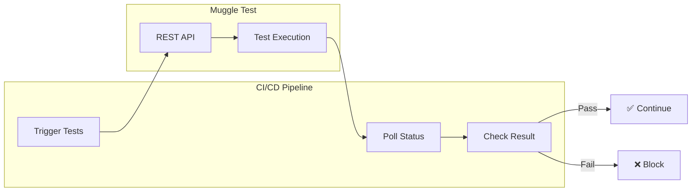

# MCP CI/CD Integration

Integrate Muggle Test into your continuous integration and deployment pipelines.

## Overview

While the MCP Gateway is designed for interactive AI assistant use, you can also trigger tests programmatically in CI/CD pipelines using the REST API directly.



## Prerequisites

| Requirement         | Description                                |
| :------------------ | :----------------------------------------- |
| Muggle Test project | With test scripts ready to run             |
| Project ID          | Found in dashboard URL or project settings |
| API key             | With appropriate permissions               |

## Supported Platforms

| Platform       | Trigger | Schedule | Status Checks |
| :------------- | :-----: | :------: | :-----------: |
| GitHub Actions |    ✅    |    ✅     |       ✅       |
| Azure DevOps   |    ✅    |    ✅     |       ✅       |
| GitLab CI      |    ✅    |    ✅     |       ✅       |
| Jenkins        |    ✅    |    ✅     |       ✅       |
| CircleCI       |    ✅    |    ✅     |       ✅       |

## GitHub Actions

### Basic Integration

Create `.github/workflows/muggle-test.yml`:

```yaml
name: Muggle Test

on:
  pull_request:
    branches: [main, master]
  workflow_dispatch:

jobs:
  test:
    runs-on: ubuntu-latest
    steps:
      - name: Trigger Muggle Tests
        id: trigger
        run: |
          RESPONSE=$(curl -s -X POST \
            "https://api.muggle-ai.com/v1/protected/muggle-test/workflow/test-script/test-script-replay/bulk/workflowRuntimes" \
            -H "x-api-key: ${{ secrets.MUGGLE_AI_API_KEY }}" \
            -H "Content-Type: application/json" \
            -d '{"projectId": "${{ vars.MUGGLE_PROJECT_ID }}"}')
          
          RUNTIME_ID=$(echo $RESPONSE | jq -r '.workflowRuntimeId')
          echo "runtime_id=$RUNTIME_ID" >> $GITHUB_OUTPUT

      - name: Wait for Tests
        run: |
          RUNTIME_ID="${{ steps.trigger.outputs.runtime_id }}"
          
          for i in {1..60}; do
            STATUS=$(curl -s \
              "https://api.muggle-ai.com/v1/protected/muggle-test/workflow/test-script/test-script-replay/bulk/$RUNTIME_ID/run/latest" \
              -H "x-api-key: ${{ secrets.MUGGLE_AI_API_KEY }}" | jq -r '.status')
            
            echo "Status: $STATUS"
            
            if [ "$STATUS" = "succeeded" ]; then
              echo "Tests passed!"
              exit 0
            elif [ "$STATUS" = "failed" ]; then
              echo "Tests failed!"
              exit 1
            fi
            
            sleep 30
          done
          
          echo "Timeout waiting for tests"
          exit 1
```

### Setup Steps

| Step | Action                                              |
| :--- | :-------------------------------------------------- |
| 1    | Add `MUGGLE_AI_API_KEY` to repository **Secrets**   |
| 2    | Add `MUGGLE_PROJECT_ID` to repository **Variables** |
| 3    | Commit the workflow file                            |

## Azure DevOps

Create `azure-pipelines.yml`:

```yaml
trigger:
  - main

schedules:
  - cron: '0 2 * * *'
    displayName: Nightly Tests
    branches:
      include:
        - main

pool:
  vmImage: 'ubuntu-latest'

variables:
  - group: MuggleAI

steps:
  - script: |
      RESPONSE=$(curl -s -X POST \
        "https://api.muggle-ai.com/v1/protected/muggle-test/workflow/test-script/test-script-replay/bulk/workflowRuntimes" \
        -H "x-api-key: $(MUGGLE_AI_API_KEY)" \
        -H "Content-Type: application/json" \
        -d '{"projectId": "$(MUGGLE_PROJECT_ID)"}')
      
      RUNTIME_ID=$(echo $RESPONSE | jq -r '.workflowRuntimeId')
      echo "##vso[task.setvariable variable=RUNTIME_ID]$RUNTIME_ID"
    displayName: 'Trigger Tests'

  - script: |
      for i in {1..60}; do
        STATUS=$(curl -s \
          "https://api.muggle-ai.com/v1/protected/muggle-test/workflow/test-script/test-script-replay/bulk/$(RUNTIME_ID)/run/latest" \
          -H "x-api-key: $(MUGGLE_AI_API_KEY)" | jq -r '.status')
        
        if [ "$STATUS" = "succeeded" ]; then exit 0; fi
        if [ "$STATUS" = "failed" ]; then exit 1; fi
        
        sleep 30
      done
      exit 1
    displayName: 'Wait for Results'
```

## GitLab CI

Create `.gitlab-ci.yml`:

```yaml
stages:
  - test

muggle-tests:
  stage: test
  image: curlimages/curl:latest
  rules:
    - if: $CI_PIPELINE_SOURCE == "merge_request_event"
    - if: $CI_PIPELINE_SOURCE == "schedule"
  script:
    - |
      RESPONSE=$(curl -s -X POST \
        "https://api.muggle-ai.com/v1/protected/muggle-test/workflow/test-script/test-script-replay/bulk/workflowRuntimes" \
        -H "x-api-key: $MUGGLE_AI_API_KEY" \
        -H "Content-Type: application/json" \
        -d "{\"projectId\": \"$MUGGLE_PROJECT_ID\"}")
      
      RUNTIME_ID=$(echo $RESPONSE | jq -r '.workflowRuntimeId')
      
      for i in $(seq 1 60); do
        STATUS=$(curl -s \
          "https://api.muggle-ai.com/v1/protected/muggle-test/workflow/test-script/test-script-replay/bulk/$RUNTIME_ID/run/latest" \
          -H "x-api-key: $MUGGLE_AI_API_KEY" | jq -r '.status')
        
        if [ "$STATUS" = "succeeded" ]; then exit 0; fi
        if [ "$STATUS" = "failed" ]; then exit 1; fi
        
        sleep 30
      done
      exit 1
```

## Webhook Notifications

Configure webhooks to receive test results in your systems:

**Configuration:**

```json
{
  "projectId": "proj_abc123",
  "channels": ["webhook"],
  "webhookUrl": "https://your-server.com/webhooks/muggle"
}
```

**Payload received:**

```json
{
  "event": "test_run_completed",
  "projectId": "proj_abc123",
  "timestamp": "2024-01-15T10:35:00Z",
  "results": {
    "total": 10,
    "passed": 8,
    "failed": 2
  }
}
```

## Best Practices

### Use Dedicated API Keys

| Practice                      | Benefit                        |
| :---------------------------- | :----------------------------- |
| Separate keys per environment | Better access control          |
| Rotate periodically           | Limits exposure if compromised |
| Descriptive names             | Easier audit trail             |

### Set Appropriate Timeouts

| Test Type       | Recommended Timeout |
| :-------------- | ------------------: |
| Smoke tests     |        5-10 minutes |
| Feature tests   |       15-30 minutes |
| Full regression |       30-60 minutes |

### Run Subset on PRs

For faster PR feedback, run only critical smoke tests:

```bash
-d '{"projectId": "...", "testScriptIds": ["ts_smoke_1", "ts_smoke_2"]}'
```

### Schedule Full Regression

Run comprehensive tests during off-hours:

```yaml
schedules:
  - cron: '0 2 * * *'  # 2 AM daily
```

## Troubleshooting

| Issue                 | Possible Cause        | Solution                |
| :-------------------- | :-------------------- | :---------------------- |
| Tests not starting    | Invalid API key       | Verify key in dashboard |
| Tests not starting    | Invalid project ID    | Check ID format         |
| Timeout errors        | Tests taking too long | Increase poll timeout   |
| Timeout errors        | Too many tests        | Run subset on PRs       |
| Authentication errors | Expired API key       | Regenerate key          |
| Authentication errors | Wrong environment     | Check key matches env   |

## Next Steps

- **[MCP Quickstart](getting-started/mcp-quickstart.md)** - Interactive setup
- **[MCP API Reference](mcp/mcp-api-reference.md)** - Complete documentation
