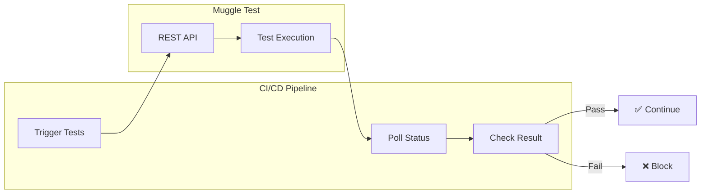

# MCP CI/CD Integration

Integrate Muggle Test into your continuous integration and deployment pipelines.

## Overview

While the MCP Gateway is designed for interactive AI assistant use, you can also trigger tests programmatically in CI/CD pipelines using the REST API directly.


```mermaid
flowchart LR
    subgraph ci["CI/CD Pipeline"]
        trigger["Trigger Tests"]
        poll["Poll Status"]
        result["Check Result"]
    end
    
    subgraph muggle["Muggle Test"]
        api["REST API"]
        exec["Test Execution"]
    end
    
    trigger --> api
    api --> exec
    exec --> poll
    poll --> result
    result -->|Pass| pass["✅ Continue"]
    result -->|Fail| fail["❌ Block"]
```

## Prerequisites

| Requirement         | Description                                |
| :------------------ | :----------------------------------------- |
| Muggle Test project | With test scripts ready to run             |
| Project ID          | Found in dashboard URL or project settings |
| API key             | With appropriate permissions               |

## Supported Platforms

| Platform       | Trigger | Schedule | Status Checks |
| :------------- | :-----: | :------: | :-----------: |
| GitHub Actions |    ✅    |    ✅     |       ✅       |
| Azure DevOps   |    ✅    |    ✅     |       ✅       |
| GitLab CI      |    ✅    |    ✅     |       ✅       |
| Jenkins        |    ✅    |    ✅     |       ✅       |
| CircleCI       |    ✅    |    ✅     |       ✅       |

## GitHub Actions

### Basic Integration

The flow has three phases:

1. **Trigger**: POST to the bulk replay endpoint to create a workflow runtime. The response returns the runtime `id`.
2. **Wait for run batch**: poll `.../bulk/{id}/run/latest` until the run exposes a `runBatchId` in its `result` payload.
3. **Wait for summary**: poll `.../bulk/run-batch/{runBatchId}/summary` until no items are running or pending, then compute pass rate against executed runs (success + failed + canceled; skipped are excluded).

Create `.github/workflows/muggle-e2e.yml`:

```yaml
name: Muggle Test E2E acceptance

on:
  pull_request:
    branches: [main, master]
  workflow_dispatch:

env:
  MUGGLE_AI_API_BASE_URL: "https://api.muggle-ai.com"
  PASS_RATE_THRESHOLD: "100"
  POLL_INTERVAL_SECONDS: "20"
  TIMEOUT_MINUTES: "45"

jobs:
  test:
    runs-on: ubuntu-latest
    steps:
      - name: Trigger Muggle Test bulk replay
        id: trigger
        env:
          MUGGLE_AI_API_KEY: ${{ secrets.MUGGLE_AI_API_KEY }}
          PROJECT_ID: ${{ vars.MUGGLE_PROJECT_ID }}
        run: |
          set -euo pipefail
          RESPONSE=$(curl -sS -X POST \
            "${MUGGLE_AI_API_BASE_URL}/v1/protected/muggle-test/workflow/test-script/test-script-replay/bulk/workflowRuntimes" \
            -H "Content-Type: application/json" \
            -H "x-api-key: ${MUGGLE_AI_API_KEY}" \
            -d "{\"projectId\": \"${PROJECT_ID}\", \"namePrefix\": \"ci\"}")

          RUNTIME_ID=$(echo "${RESPONSE}" | jq -r '.id // empty')
          if [[ -z "${RUNTIME_ID}" ]]; then
            echo "::error::Missing workflow runtime id in response: ${RESPONSE}"
            exit 1
          fi
          echo "runtime_id=${RUNTIME_ID}" >> "$GITHUB_OUTPUT"

      - name: Wait for run batch and summary
        env:
          MUGGLE_AI_API_KEY: ${{ secrets.MUGGLE_AI_API_KEY }}
          WORKFLOW_RUNTIME_ID: ${{ steps.trigger.outputs.runtime_id }}
        run: |
          set -euo pipefail
          MAX_WAIT_SECONDS=$((TIMEOUT_MINUTES * 60))
          START_TIME="$(date +%s)"
          RUN_BATCH_ID=""

          while true; do
            NOW="$(date +%s)"
            if (( NOW - START_TIME >= MAX_WAIT_SECONDS )); then
              echo "::error::Timed out after ${TIMEOUT_MINUTES} minutes"
              exit 1
            fi

            RUN_FILE="$(mktemp)"
            curl -sS -o "${RUN_FILE}" \
              "${MUGGLE_AI_API_BASE_URL}/v1/protected/muggle-test/workflow/test-script/test-script-replay/bulk/${WORKFLOW_RUNTIME_ID}/run/latest" \
              -H "x-api-key: ${MUGGLE_AI_API_KEY}"

            RUN_STATUS="$(jq -r '.status // empty' "${RUN_FILE}")"
            RUN_BATCH_ID="$(jq -r '
              if (.result|type) == "string"
                then ((.result|fromjson? // {}) | .runBatchId // empty)
                else (.result.runBatchId // empty)
              end' "${RUN_FILE}")"

            if [[ -z "${RUN_BATCH_ID}" ]]; then
              sleep "${POLL_INTERVAL_SECONDS}"
              continue
            fi

            SUMMARY_FILE="$(mktemp)"
            SUMMARY_HTTP=$(curl -sS -o "${SUMMARY_FILE}" -w "%{http_code}" \
              "${MUGGLE_AI_API_BASE_URL}/v1/protected/muggle-test/workflow/test-script/test-script-replay/bulk/run-batch/${RUN_BATCH_ID}/summary" \
              -H "x-api-key: ${MUGGLE_AI_API_KEY}")
            if [[ "${SUMMARY_HTTP}" == "404" ]]; then
              sleep "${POLL_INTERVAL_SECONDS}"
              continue
            fi
            if [[ "${SUMMARY_HTTP}" != "200" ]]; then
              echo "::error::Summary fetch failed (HTTP ${SUMMARY_HTTP})"
              cat "${SUMMARY_FILE}"
              exit 1
            fi

            SUCCESS=$(jq -r '.successCount'  "${SUMMARY_FILE}")
            FAILED=$(jq  -r '.failedCount'   "${SUMMARY_FILE}")
            CANCELED=$(jq -r '.canceledCount' "${SUMMARY_FILE}")
            RUNNING=$(jq  -r '.runningCount'  "${SUMMARY_FILE}")
            PENDING=$(jq  -r '.pendingCount'  "${SUMMARY_FILE}")

            # Consider finished when nothing is running AND (nothing pending OR run COMPLETED)
            if [[ "${RUNNING}" -eq 0 ]] && { [[ "${PENDING}" -eq 0 ]] || [[ "${RUN_STATUS}" == "COMPLETED" ]]; }; then
              ACTUAL=$((SUCCESS + FAILED + CANCELED))
              if [[ "${ACTUAL}" -eq 0 ]]; then
                PASS_RATE="100.00"
              else
                PASS_RATE=$(awk "BEGIN { printf \"%.2f\", (${SUCCESS} * 100) / ${ACTUAL} }")
              fi
              echo "Pass rate: ${PASS_RATE}% (success=${SUCCESS} failed=${FAILED} canceled=${CANCELED})"
              if awk "BEGIN { exit !(${PASS_RATE} >= ${PASS_RATE_THRESHOLD}) }"; then
                exit 0
              fi
              echo "::error::Pass rate ${PASS_RATE}% below threshold ${PASS_RATE_THRESHOLD}%"
              exit 1
            fi

            sleep "${POLL_INTERVAL_SECONDS}"
          done
```

### Setup Steps

| Step | Action                                              |
| :--- | :-------------------------------------------------- |
| 1    | Add `MUGGLE_AI_API_KEY` to repository **Secrets**   |
| 2    | Add `MUGGLE_PROJECT_ID` to repository **Variables** |
| 3    | Commit the workflow file                            |

### Optional: Trigger a Report After Replay

After the summary reports success, you can generate and deliver a project report (delivery channels come from the project's report preferences):

```yaml
      - name: Generate project report
        if: success()
        env:
          MUGGLE_AI_API_KEY: ${{ secrets.MUGGLE_AI_API_KEY }}
          PROJECT_ID: ${{ vars.MUGGLE_PROJECT_ID }}
        run: |
          curl -sS -X POST \
            "${MUGGLE_AI_API_BASE_URL}/v1/protected/muggle-test/report/final/generate" \
            -H "Content-Type: application/json" \
            -H "x-api-key: ${MUGGLE_AI_API_KEY}" \
            -d "{\"projectId\": \"${PROJECT_ID}\", \"exportFormat\": \"html\", \"channels\": []}"
```

## Azure DevOps and GitLab CI

Both platforms follow the same three-phase pattern shown above: **trigger → wait for `runBatchId` → poll `/run-batch/{id}/summary` → compute pass rate**.

Differences are limited to how the platform exposes secrets and variables:

| Platform     | Secret syntax        | Variable syntax      |
| :----------- | :------------------- | :------------------- |
| Azure DevOps | `$(MUGGLE_AI_API_KEY)` | `$(MUGGLE_PROJECT_ID)` |
| GitLab CI    | `$MUGGLE_AI_API_KEY`   | `$MUGGLE_PROJECT_ID`   |

Copy the bash logic from the GitHub Actions example above and substitute the platform-specific variable syntax. Do **not** rely on `.status == "succeeded"` — that field never takes those values; always go through the `run-batch/{id}/summary` endpoint and compute pass rate from `successCount / (successCount + failedCount + canceledCount)`.

## Webhook Notifications

Configure webhooks to receive test results in your systems:

**Configuration:**

```json
{
  "projectId": "proj_abc123",
  "channels": ["webhook"],
  "webhookUrl": "https://your-server.com/webhooks/muggle"
}
```

**Payload received:**

```json
{
  "event": "test_run_completed",
  "projectId": "proj_abc123",
  "timestamp": "2024-01-15T10:35:00Z",
  "results": {
    "total": 10,
    "passed": 8,
    "failed": 2
  }
}
```

## Best Practices

### Use Dedicated API Keys

| Practice                      | Benefit                        |
| :---------------------------- | :----------------------------- |
| Separate keys per environment | Better access control          |
| Rotate periodically           | Limits exposure if compromised |
| Descriptive names             | Easier audit trail             |

### Set Appropriate Timeouts

| Test Type       | Recommended Timeout |
| :-------------- | ------------------: |
| Smoke tests     |        5-10 minutes |
| Feature tests   |       15-30 minutes |
| Full regression |       30-60 minutes |

### Run Subset on PRs

For faster PR feedback, run only critical smoke tests:

```bash
-d '{"projectId": "...", "testScriptIds": ["ts_smoke_1", "ts_smoke_2"]}'
```

### Schedule Full Regression

Run comprehensive tests during off-hours:

```yaml
schedules:
  - cron: '0 2 * * *'  # 2 AM daily
```

## Troubleshooting

| Issue                 | Possible Cause        | Solution                |
| :-------------------- | :-------------------- | :---------------------- |
| Tests not starting    | Invalid API key       | Verify key in dashboard |
| Tests not starting    | Invalid project ID    | Check ID format         |
| Timeout errors        | Tests taking too long | Increase poll timeout   |
| Timeout errors        | Too many tests        | Run subset on PRs       |
| Authentication errors | Expired API key       | Regenerate key          |
| Authentication errors | Wrong environment     | Check key matches env   |

## Next Steps

- **[MCP Quickstart](getting-started/mcp-quickstart.md)** - Interactive setup
- **[MCP API Reference](mcp/mcp-api-reference.md)** - Complete documentation
