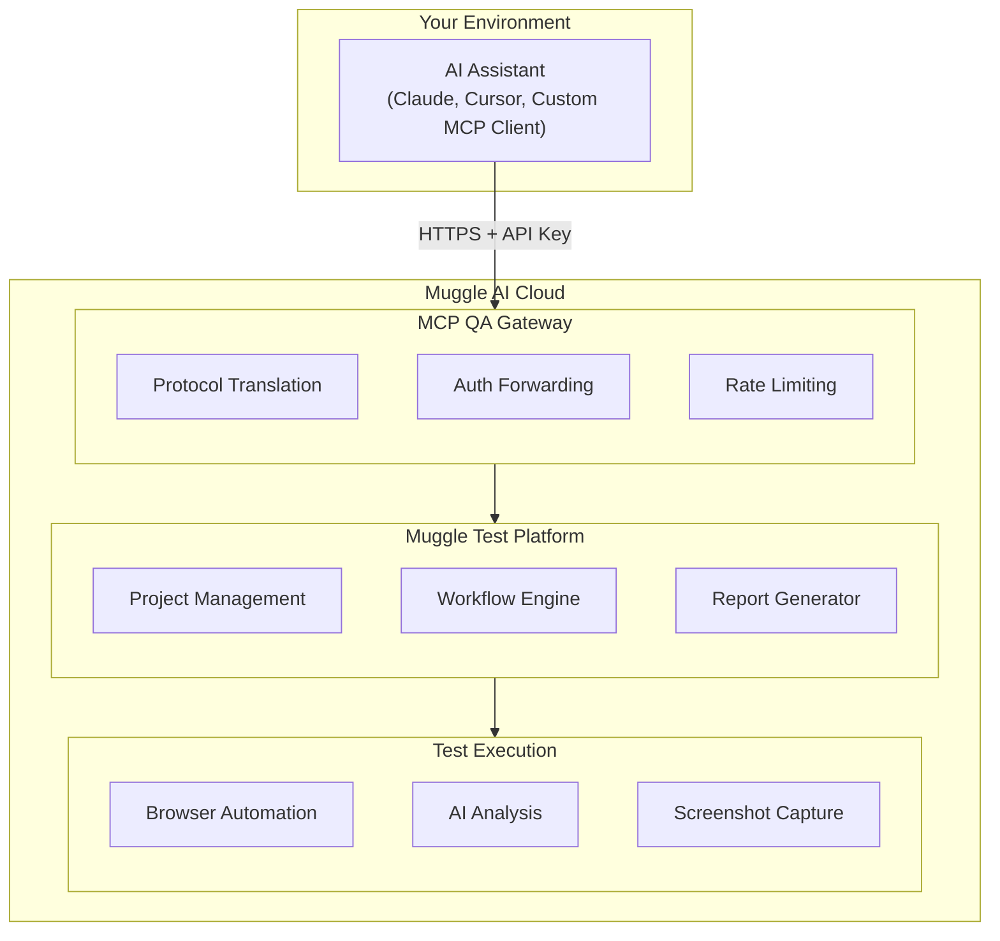
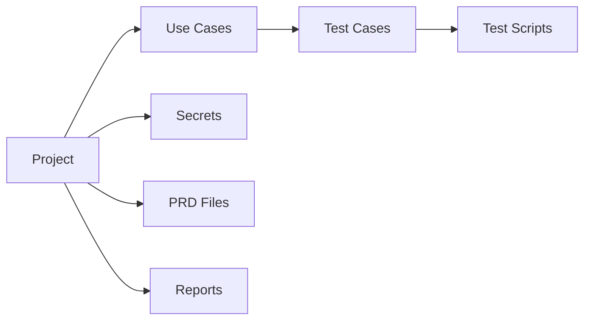
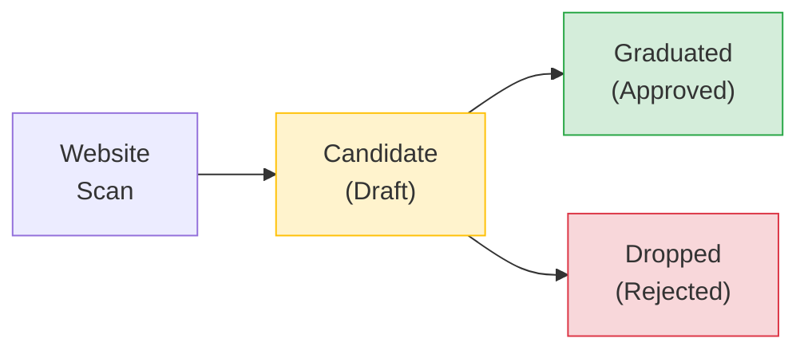
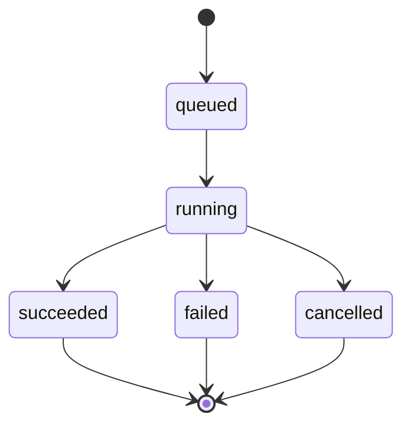
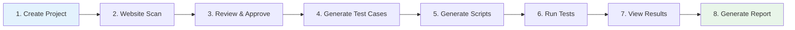

# MCP Concepts & Architecture

Understanding how the MCP Gateway works with Muggle Test.

## System Architecture



## What is MCP?

The [Model Context Protocol (MCP)](https://modelcontextprotocol.io/) is an open standard for connecting AI assistants to external tools and data sources.

| Feature                    | Description                                                        |
| :------------------------- | :----------------------------------------------------------------- |
| **Standardized Interface** | Common protocol for tool invocation across different AI assistants |
| **Streaming Support**      | Real-time updates for long-running operations                      |
| **Tool Discovery**         | AI assistants automatically discover available capabilities        |

## Core Concepts

### Projects

A **Project** is the top-level container for all your testing artifacts. Each project typically corresponds to one website or application.



### Use Cases

A **Use Case** represents a user flow or feature to test (e.g., "User Login", "Checkout Process").

**Lifecycle:**



| Stage         | Description                                   |
| :------------ | :-------------------------------------------- |
| **Discovery** | Website scan identifies potential use cases   |
| **Candidate** | Proposed use cases await your review          |
| **Graduated** | Approved use cases become active test targets |
| **Dropped**   | Rejected candidates are archived              |

### Test Cases

A **Test Case** is a specific scenario derived from a use case. Each use case may have multiple test cases:

| Use Case   | Test Cases                           |
| :--------- | :----------------------------------- |
| User Login | Valid credentials → successful login |
|            | Invalid password → error message     |
|            | Empty fields → validation errors     |
|            | Account locked → lockout message     |

### Test Scripts

A **Test Script** is executable automation generated from a test case. Scripts contain:

| Component           | Description                                 |
| :------------------ | :------------------------------------------ |
| **Browser Actions** | Step-by-step navigation, clicks, form fills |
| **Assertions**      | Validations and expected outcomes           |
| **Screenshots**     | Visual capture at each step                 |

### Workflows

**Workflows** are long-running operations:

| Workflow               | Purpose             | Output              |
| :--------------------- | :------------------ | :------------------ |
| Website Scan           | Discover use cases  | Use case candidates |
| Test Case Detection    | Generate test cases | Test cases          |
| Test Script Generation | Create automation   | Test scripts        |
| Test Script Replay     | Execute tests       | Test results        |
| Report Generation      | Create reports      | PDF/HTML reports    |

**Workflow states:**



## Testing Flow



## Authentication

### API Keys

API keys provide programmatic access:

```
mai_sk_xxxxxxxxxxxxxxxxxxxxxxxxxxxxxxxx
│     │
│     └── Secret portion (keep private)
└── Prefix identifying key type
```

**Best practices:**

| Practice                          | Reason                         |
| :-------------------------------- | :----------------------------- |
| Rotate keys periodically          | Limits exposure if compromised |
| Use separate keys per environment | Better access control          |
| Never expose in client-side code  | Prevents unauthorized access   |
| Store in secrets managers         | Secure storage                 |

### Authorization

All API calls are scoped to your account:

| Scope          | Description                                                 |
| :------------- | :---------------------------------------------------------- |
| **Projects**   | Access only projects you own or have been granted access to |
| **Team Roles** | Members can be granted viewer, editor, or admin roles       |
| **API Keys**   | Inherit permissions of the creating user                    |

## Rate Limits

The gateway enforces rate limits to ensure fair usage:

| Tier       | Requests/min | Concurrent Workflows |
| :--------- | -----------: | -------------------: |
| Free       |           20 |                    1 |
| Pro        |           60 |                    5 |
| Enterprise |          300 |                   20 |

**Rate limit headers:**

| Header                  | Description                             |
| :---------------------- | :-------------------------------------- |
| `X-RateLimit-Limit`     | Maximum requests allowed                |
| `X-RateLimit-Remaining` | Requests remaining in window            |
| `X-RateLimit-Reset`     | Time when limit resets (Unix timestamp) |

## Available Tools

The gateway provides 46+ tools organized into categories:

| Category        | Count | Purpose                        |
| :-------------- | ----: | :----------------------------- |
| Project         |     4 | Create and manage projects     |
| PRD Files       |     3 | Upload requirements documents  |
| Secrets         |     5 | Manage test credentials        |
| Use Cases       |     4 | Discover and approve use cases |
| Workflows       |    17 | Execute testing workflows      |
| Artifacts       |     9 | Inspect test cases and scripts |
| Reports         |     4 | Generate and deliver reports   |
| Recommendations |     2 | Get scheduling guidance        |

## Next Steps

- **[MCP Quickstart](getting-started/mcp-quickstart.md)** - Get started in 5 minutes
- **[MCP API Reference](mcp/mcp-api-reference.md)** - Complete tool documentation
- **[CI/CD Integration](mcp/mcp-cicd-integration.md)** - Automate in your pipeline
