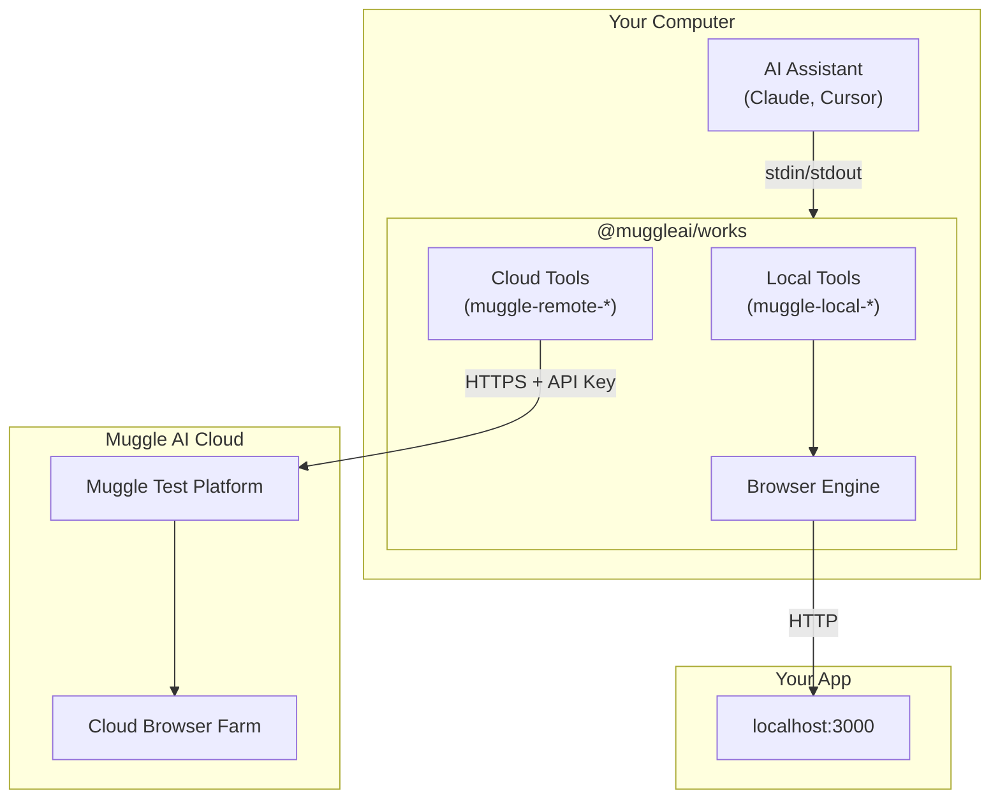
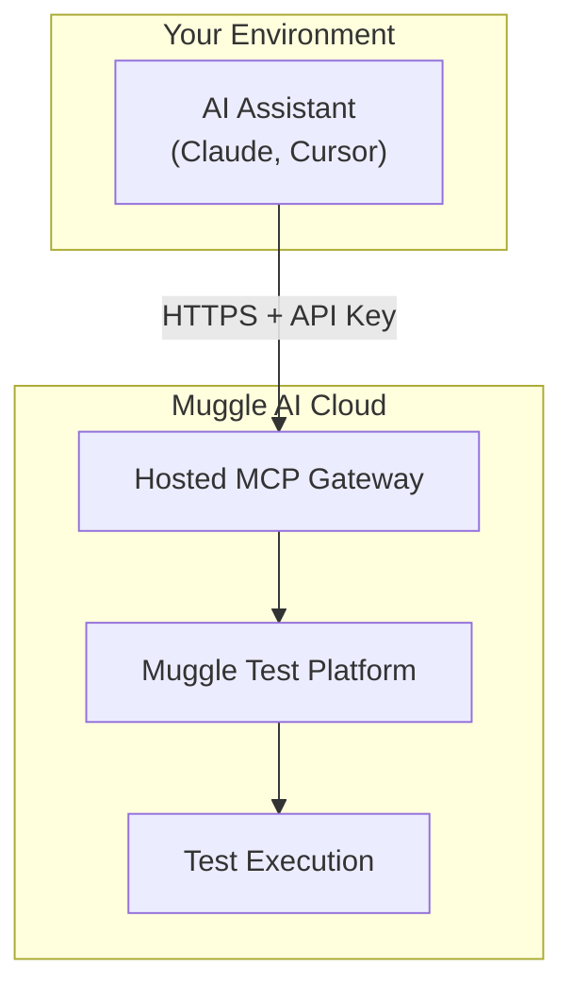
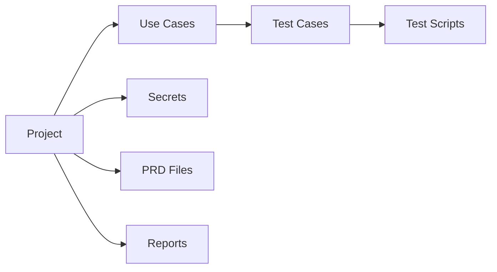
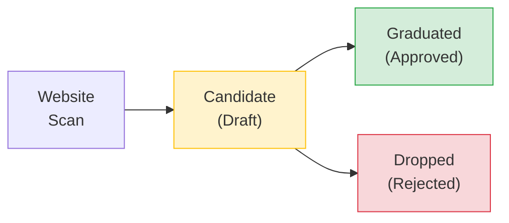
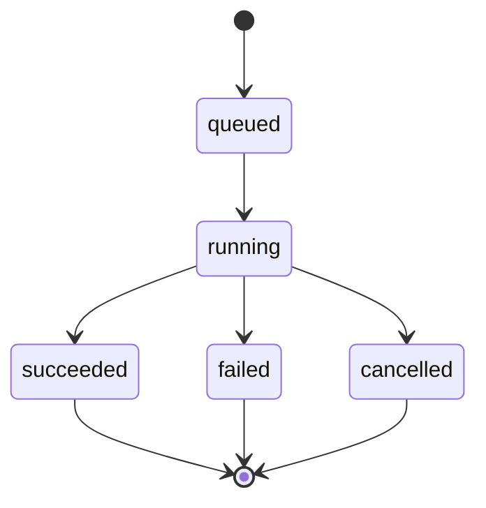
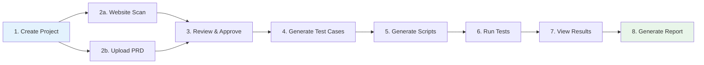
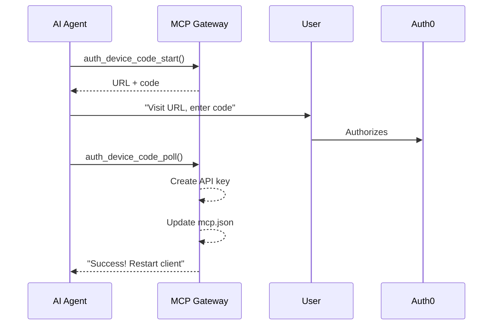

# MCP Concepts & Architecture

Understanding how the `@muggleai/works` package works with Muggle Test.

## System Architecture

The unified MCP package supports multiple modes: **Cloud QA**, **Local Testing**, or **both combined**.

### Unified Package (Recommended)


```mermaid
flowchart TB
    subgraph env["Your Computer"]
        client["AI Assistant<br/>(Claude, Cursor)"]
        subgraph mcp["@muggleai/works"]
            direction TB
            local["Local Tools<br/>(muggle-local-*)"]
            cloud["Cloud Tools<br/>(muggle-remote-*)"]
            browser["Browser Engine"]
        end
        client -->|"stdin/stdout"| mcp
        local --> browser
    end

    subgraph app["Your App"]
        localhost["localhost:3000"]
    end

    subgraph cloudEnv["Muggle AI Cloud"]
        platform["Muggle Test Platform"]
        cloudBrowser["Cloud Browser Farm"]
    end

    browser -->|"HTTP"| localhost
    cloud -->|"HTTPS + API Key"| platform
    platform --> cloudBrowser
```

The unified package provides both local and cloud testing:
- **Local Tools** (`muggle-local-*`): Test localhost with the bundled browser engine
- **Cloud Tools** (`muggle-remote-*`): Test remote URLs using Muggle AI's cloud infrastructure

### Hosted Gateway (Cloud-Only)

For quick setup without local installation, use the hosted gateway:


```mermaid
flowchart TB
    subgraph env["Your Environment"]
        client2["AI Assistant<br/>(Claude, Cursor)"]
    end

    subgraph cloud["Muggle AI Cloud"]
        gateway["Hosted MCP Gateway"]
        platform["Muggle Test Platform"]
        exec["Test Execution"]
    end

    client2 -->|"HTTPS + API Key"| gateway
    gateway --> platform
    platform --> exec
```

### Mode Comparison

| Aspect | Unified Package | Hosted Gateway |
| :----- | :-------------- | :------------- |
| **Local Testing** | Yes | No |
| **Cloud Testing** | Yes | Yes |
| **Setup** | `npm install -g @muggleai/works@latest` | Configure URL only |
| **Latency** | Lowest (no gateway hop) | Network to gateway |
| **Credentials** | Environment variables | Per-request headers |
| **Best for** | Full functionality | Quick start, cloud-only |

See [MCP Installation](mcp-installation.md) for detailed setup instructions.

## What is MCP?

The [Model Context Protocol (MCP)](https://modelcontextprotocol.io/) is an open standard for connecting AI assistants to external tools and data sources.

| Feature                    | Description                                                        |
| :------------------------- | :----------------------------------------------------------------- |
| **Standardized Interface** | Common protocol for tool invocation across different AI assistants |
| **Streaming Support**      | Real-time updates for long-running operations                      |
| **Tool Discovery**         | AI assistants automatically discover available capabilities        |

## Core Concepts

### Projects

A **Project** is the top-level container for all your testing artifacts. Each project typically corresponds to one website or application.


```mermaid
graph LR
    P[Project] --> UC[Use Cases]
    P --> S[Secrets]
    P --> PRD[PRD Files]
    P --> R[Reports]

    UC --> TC[Test Cases]
    TC --> TS[Test Scripts]
```

### Use Cases

A **Use Case** represents a user flow or feature to test (e.g., "User Login", "Checkout Process").

**Lifecycle:**


```mermaid
flowchart LR
    scan["Website<br/>Scan"] --> candidate["Candidate<br/>(Draft)"]
    candidate --> graduated["Graduated<br/>(Approved)"]
    candidate --> dropped["Dropped<br/>(Rejected)"]

    style graduated fill:#d4edda,stroke:#28a745
    style dropped fill:#f8d7da,stroke:#dc3545
    style candidate fill:#fff3cd,stroke:#ffc107
```

| Stage         | Description                                   |
| :------------ | :-------------------------------------------- |
| **Discovery** | Website scan identifies potential use cases   |
| **Candidate** | Proposed use cases await your review          |
| **Graduated** | Approved use cases become active test targets |
| **Dropped**   | Rejected candidates are archived              |

### Test Cases

A **Test Case** is a specific scenario derived from a use case. Each use case may have multiple test cases:

| Use Case   | Test Cases                           |
| :--------- | :----------------------------------- |
| User Login | Valid credentials → successful login |
|            | Invalid password → error message     |
|            | Empty fields → validation errors     |
|            | Account locked → lockout message     |

### Test Scripts

A **Test Script** is executable automation generated from a test case. Scripts contain:

| Component           | Description                                 |
| :------------------ | :------------------------------------------ |
| **Browser Actions** | Step-by-step navigation, clicks, form fills |
| **Assertions**      | Validations and expected outcomes           |
| **Screenshots**     | Visual capture at each step                 |

### Workflows

**Workflows** are long-running operations:

| Workflow               | Purpose                    | Output              |
| :--------------------- | :------------------------- | :------------------ |
| PRD File Processing    | Extract use cases from PRD | Use case candidates |
| Website Scan           | Discover use cases         | Use case candidates |
| Test Case Detection    | Generate test cases        | Test cases          |
| Test Script Generation | Create automation          | Test scripts        |
| Test Script Replay     | Execute tests              | Test results        |
| Report Generation      | Create reports             | PDF/HTML reports    |

**Workflow states:**


```mermaid
stateDiagram-v2
    [*] --> queued
    queued --> running
    running --> succeeded
    running --> failed
    running --> cancelled
    succeeded --> [*]
    failed --> [*]
    cancelled --> [*]
```

## Testing Flow


```mermaid
flowchart LR
    A["1. Create Project"] --> B1["2a. Website Scan"]
    A --> B2["2b. Upload PRD"]
    B1 --> C["3. Review & Approve"]
    B2 --> C
    C --> D["4. Generate Test Cases"]
    D --> E["5. Generate Scripts"]
    E --> F["6. Run Tests"]
    F --> G["7. View Results"]
    G --> H["8. Generate Report"]

    style A fill:#e3f2fd
    style H fill:#e8f5e9
```

You can discover use cases via website scanning, PRD file processing, or both.

## Authentication

### Agentic Authentication (Device Code Flow)

AI agents can help users authenticate without a pre-existing API key using the **device code flow**:


```mermaid
sequenceDiagram
    participant Agent as AI Agent
    participant Gateway as MCP Gateway
    participant User as User
    participant Auth0 as Auth0
    
    Agent->>Gateway: auth_device_code_start()
    Gateway-->>Agent: URL + code
    Agent->>User: "Visit URL, enter code"
    User->>Auth0: Authorizes
    Agent->>Gateway: auth_device_code_poll()
    Gateway-->>Gateway: Create API key
    Gateway-->>Gateway: Update mcp.json
    Gateway-->>Agent: "Success! Restart client"
```

**Security**: The API key is written directly to the user's local config file and is **never** returned to the AI agent.

### API Keys

API keys provide programmatic access:

```
mai_sk_xxxxxxxxxxxxxxxxxxxxxxxxxxxxxxxx
│     │
│     └── Secret portion (keep private)
└── Prefix identifying key type
```

**Best practices:**

| Practice                          | Reason                         |
| :-------------------------------- | :----------------------------- |
| Rotate keys periodically          | Limits exposure if compromised |
| Use separate keys per environment | Better access control          |
| Never expose in client-side code  | Prevents unauthorized access   |
| Store in secrets managers         | Secure storage                 |

### Authorization

All API calls are scoped to your account:

| Scope          | Description                                                 |
| :------------- | :---------------------------------------------------------- |
| **Projects**   | Access only projects you own or have been granted access to |
| **Team Roles** | Members can be granted viewer, editor, or admin roles       |
| **API Keys**   | Inherit permissions of the creating user                    |

## Rate Limits

The gateway enforces rate limits to ensure fair usage:

| Tier       | Requests/min | Concurrent Workflows |
| :--------- | -----------: | -------------------: |
| Free       |           20 |                    1 |
| Pro        |           60 |                    5 |
| Enterprise |          300 |                   20 |

**Rate limit headers:**

| Header                  | Description                             |
| :---------------------- | :-------------------------------------- |
| `X-RateLimit-Limit`     | Maximum requests allowed                |
| `X-RateLimit-Remaining` | Requests remaining in window            |
| `X-RateLimit-Reset`     | Time when limit resets (Unix timestamp) |

## Available Tools

The unified package provides **125+ tools** organized by mode:

### Local Testing Tools (prefix: `muggle-local-`)

| Category | Count | Purpose |
| :------- | ----: | :------ |
| Authentication | 4 | Login, logout, status |
| Projects | 5 | Local project management |
| Use Cases | 5 | Define user flows |
| Test Cases | 5 | Test specifications |
| Test Scripts | 4 | Generated automation |
| Execution | 3 | Run tests locally |
| Results | 2 | View local results |
| Publishing | 2 | Upload to cloud |
| Cloud Sync | 20+ | Pull/push between local and cloud |

### Cloud QA Tools (prefix: `muggle-remote-`)

| Category | Count | Purpose |
| :------- | ----: | :------ |
| Authentication | 7 | Authenticate and manage API keys |
| Project | 5 | Create and manage projects |
| PRD Files | 5 | Upload and process PRD files |
| Secrets | 5 | Manage test credentials |
| Wallet | 5 | Manage payment methods and topups|
| Use Cases | 7 | Discover, create, and update use cases |
| Workflows | 17 | Execute testing workflows |
| Artifacts | 11 | Inspect test cases and scripts |
| Reports | 4 | Generate and deliver reports |
| Recommendations | 2 | Get scheduling guidance |

## MCP Resources

The gateway also exposes **MCP Resources** - documentation that AI agents can read dynamically:

| Resource URI                       | Description                    |
| :--------------------------------- | :----------------------------- |
| `muggle-qa://docs/usage-guide`     | Complete workflow guide        |
| `muggle-qa://docs/quick-reference` | Quick reference for tool calls |
| `muggle-qa://docs/wallet-quickstart` | Wallet setup and topup quickstart |

AI assistants can call `resources/list` to discover available documentation, then `resources/read` to fetch the content. This helps agents understand how to use the tools effectively without you having to explain.

## Next Steps

- **[MCP Quickstart](getting-started/mcp-quickstart.md)** - Get started in 5 minutes
- **[MCP API Reference](mcp/mcp-api-reference.md)** - Complete tool documentation
- **[CI/CD Integration](mcp/mcp-cicd-integration.md)** - Automate in your pipeline
