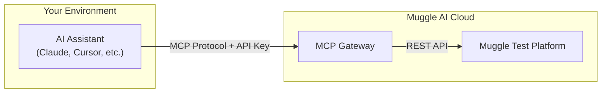

# MCP Gateway Overview

The MCP QA Gateway lets you automate Muggle Test through AI assistants using the [Model Context Protocol (MCP)](https://modelcontextprotocol.io/).

## What is the MCP Gateway?

The MCP Gateway is a hosted service that exposes Muggle Test capabilities through MCP, enabling:

- **AI Assistant Integration**: Control testing workflows through Claude, Cursor, or any MCP-compatible assistant
- **Natural Language Testing**: Use conversational commands instead of clicking through UIs
- **Programmable Automation**: Build custom integrations with MCP clients

## Architecture

Your AI assistant connects to the MCP Gateway using your API key. The gateway translates MCP tool calls into Muggle Test API requests and returns results.

## Key Benefits

### Conversational Testing

Instead of navigating dashboards, simply tell your AI assistant what you want:

> "Create a project for my e-commerce site and discover testable user flows"

### Seamless Integration

Works with any MCP-compatible client:

| Client | Description |
|:-------|:------------|
| **Claude Desktop** | Anthropic's AI assistant |
| **Cursor** | AI-powered code editor |
| **Custom clients** | Build your own MCP integration |

### Full Platform Access

The gateway exposes 46+ tools covering the complete Muggle Test workflow:

| Capability | Description |
|:-----------|:------------|
| Project management | Create, configure, and organize test projects |
| Use case discovery | Automatically find testable user flows |
| Test generation | Generate test cases and automation scripts |
| Test execution | Run tests and collect results |
| Reporting | Generate and deliver test reports |

## Getting Started

Ready to connect your AI assistant to Muggle Test?

1. **[MCP Quickstart](../getting-started/mcp-quickstart.md)** - Connect in 5 minutes
2. **[MCP Concepts](./mcp-concepts.md)** - Understand the architecture
3. **[MCP API Reference](./mcp-api-reference.md)** - Complete tool documentation

## Prerequisites

- A Muggle Test account with an active subscription
- An API key from your dashboard
- An MCP-compatible client (Claude Desktop, Cursor, etc.)
