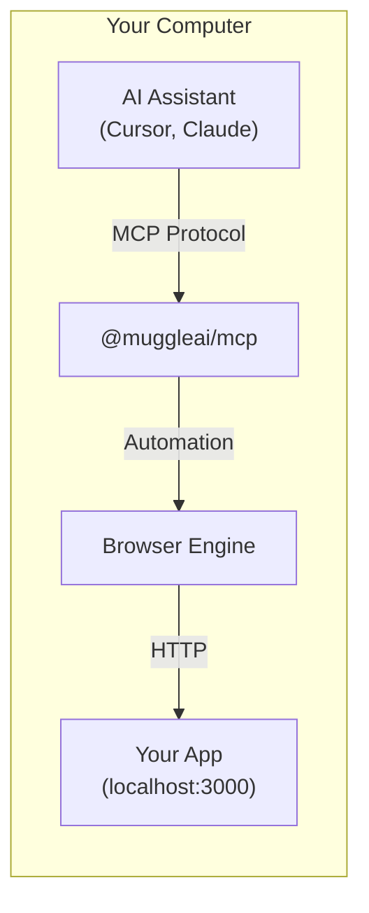
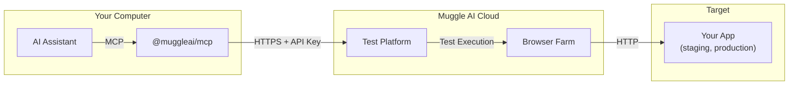

# MCP Overview

The Muggle AI MCP package lets you automate testing through AI assistants using the [Model Context Protocol (MCP)](https://modelcontextprotocol.io/).

## What is the MCP Package?

The `@muggleai/mcp` package is a **unified MCP server** that provides:

| Feature | Description |
| :------ | :---------- |
| **Local Testing** | Test localhost and local network applications |
| **Cloud QA** | Test preview, staging, and production environments |
| **AI-Driven Automation** | Use natural language to control testing workflows |
| **Single Installation** | One package for all testing needs |

## Quick Install

```bash
npm install -g @muggleai/mcp
```

## When to Use Each Mode

| Environment | Example URLs | Mode |
| :---------- | :----------- | :--- |
| Local Dev | `localhost:3000` | Local (`--local`) |
| Docker | `localhost:8080` | Local (`--local`) |
| Local Network | `192.168.1.x` | Local (`--local`) |
| Preview | `pr-123.preview.example.com` | Cloud (`--qa`) |
| Staging | `staging.example.com` | Cloud (`--qa`) |
| Production | `www.example.com` | Cloud (`--qa`) |
| Both | Any combination | Default (no flags) |

## Architecture

### Local Testing Mode


```mermaid
flowchart LR
    subgraph dev["Your Computer"]
        A["AI Assistant<br/>(Cursor, Claude)"]
        B["@muggleai/mcp"]
        C["Browser Engine"]
        D["Your App<br/>(localhost:3000)"]
        
        A -->|"MCP Protocol"| B
        B -->|"Automation"| C
        C -->|"HTTP"| D
    end
```

Local testing runs entirely on your machine:
- Browser automation engine executes tests
- Results stored locally in `~/.muggle-ai/`
- No cloud connection required

### Cloud QA Mode


```mermaid
flowchart LR
    subgraph env["Your Computer"]
        A["AI Assistant"]
        B["@muggleai/mcp"]
    end
    
    subgraph cloud["Muggle AI Cloud"]
        C[Test Platform]
        D[Browser Farm]
    end
    
    subgraph target["Target"]
        E["Your App<br/>(staging, production)"]
    end
    
    A -->|"MCP"| B
    B -->|"HTTPS + API Key"| C
    C -->|"Test Execution"| D
    D -->|"HTTP"| E
```

Cloud QA uses Muggle AI's infrastructure:
- Tests run on cloud browser farm
- Results stored in cloud dashboard
- Supports CI/CD integration

### Unified Mode (Default)

When you run `muggle-mcp serve` without flags, **both modes are active**:
- Use `muggle_*` tools for local testing
- Use `qa_*` tools for cloud QA
- Seamlessly publish local projects to cloud

## Key Benefits

### Single Installation

No need to manage multiple packages:

| Before | After |
| :----- | :---- |
| `@muggleai/mcp-qa-gateway` | `@muggleai/mcp` |
| `@muggle-ai/local-mcp` | (unified) |
| Two configurations | One configuration |

### Natural Language Testing

Instead of navigating dashboards or writing scripts:

> "Create a project for my e-commerce site and test the checkout flow"

### Seamless Local-to-Cloud Workflow

1. **Develop locally** - Test on localhost
2. **Generate scripts** - AI creates automation
3. **Publish to cloud** - One command to deploy
4. **Scale testing** - Run in CI/CD

## Tool Categories

| Category | Count | Description |
| :------- | ----: | :---------- |
| **Local Testing** | ~65 | Project management, execution, results |
| **Cloud QA** | ~60 | Workflows, test generation, reporting |
| **Total** | ~125 | All testing needs covered |

### Local Tools (prefix: `muggle_`)

| Category | Tools | Purpose |
| :------- | :---- | :------ |
| Authentication | `muggle_auth_*` | Login, logout, status |
| Projects | `muggle_project_*` | Create and manage projects |
| Use Cases | `muggle_use_case_*` | Define user flows |
| Test Cases | `muggle_test_case_*` | Test specifications |
| Test Scripts | `muggle_test_script_*` | Automation scripts |
| Execution | `muggle_execute_*` | Run tests |
| Results | `muggle_run_result_*` | View results |
| Cloud Sync | `muggle_cloud_*`, `muggle_publish_*` | Sync with cloud |

### Cloud QA Tools (prefix: `qa_`)

| Category | Tools | Purpose |
| :------- | :---- | :------ |
| Projects | `qa_project_*` | Cloud project management |
| Use Cases | `qa_use_case_*` | Use case discovery |
| Test Cases | `qa_test_case_*` | Test case generation |
| Workflows | `qa_workflow_*` | Automated workflows |
| Reports | `qa_report_*` | Test reporting |
| Secrets | `qa_secret_*` | Credential management |

## Getting Started

Ready to connect your AI assistant to Muggle Test?

1. **[MCP Quickstart](../getting-started/mcp-quickstart.md)** - Get started in 5 minutes
2. **[MCP Installation](mcp-installation.md)** - Detailed setup options
3. **[Local Testing Setup](../local-testing/setup.md)** - Focus on localhost testing
4. **[MCP Concepts](mcp-concepts.md)** - Understand the architecture
5. **[MCP API Reference](mcp-api-reference.md)** - Complete tool documentation

## Requirements

| Requirement | Version |
| :---------- | :------ |
| Node.js | 22+ |
| MCP Client | Cursor, Claude Desktop, or compatible |
| Operating System | macOS, Windows, or Linux |
