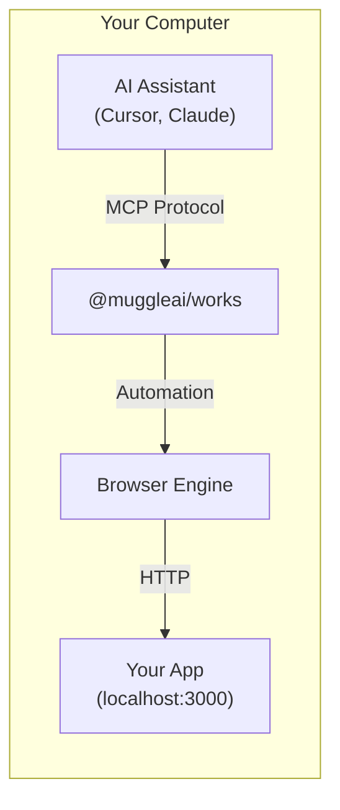
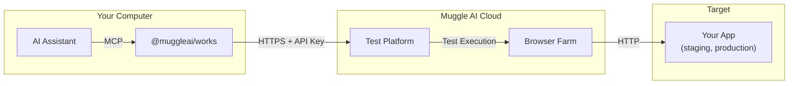

# MCP Overview

Ship quality products, not just code. The Muggle Test MCP package provides AI-powered end-to-end (E2E) acceptance testing that validates your web app like a real user, through AI assistants using the [Model Context Protocol (MCP)](https://modelcontextprotocol.io/).

## On This Page

| Section | Description |
| :------ | :---------- |
| [What is the MCP Package?](#what-is-the-mcp-package) | Package features and supported platforms |
| [Quick Install](#quick-install) | One-line install for each platform |
| [When to Use Each Mode](#when-to-use-each-mode) | Local vs cloud vs unified |
| [Architecture](#architecture) | How local, cloud, and unified modes work |
| [Key Benefits](#key-benefits) | Single installation, natural language testing, local-to-cloud workflow |
| [Tool Categories](#tool-categories) | Local and cloud tool breakdown |
| [Getting Started](#getting-started) | Links to quickstarts and guides |
| [Requirements](#requirements) | Node.js, MCP client, and OS |

## What is the MCP Package?

The `@muggleai/works` package is a **unified MCP server** that lets AI coding agents run real-browser E2E acceptance tests on your web app — generate test scripts from plain English, replay them on localhost, capture screenshots, and validate user flows like signup, checkout, and dashboards.

| Feature | Description |
| :------ | :---------- |
| **Local Testing** | Test localhost and local network applications with a real Electron browser |
| **Cloud E2E** | Test preview, staging, and production environments |
| **AI-Driven Automation** | Describe what to test in plain English — the AI handles the rest |
| **Single Installation** | One package for all testing needs, works across Claude Code, Cursor, Antigravity, and other MCP-compatible clients |

## Quick Install

**Claude Code:**

```
/plugin marketplace add https://github.com/multiplex-ai/muggle-ai-works
/plugin install muggleai@muggle-works
```

**Cursor, Antigravity, or other MCP clients:**

```bash
npm install -g @muggleai/works@latest
```

One command installs the MCP server, downloads the browser engine, and configures Cursor automatically (`~/.cursor/mcp.json`). Just restart Cursor after install.

## When to Use Each Mode

| Environment | Example URLs | Mode |
| :---------- | :----------- | :--- |
| Local Dev | `localhost:3000` | Local (`--local`) |
| Docker | `localhost:8080` | Local (`--local`) |
| Local Network | `192.168.1.x` | Local (`--local`) |
| Preview | `pr-123.preview.example.com` | Cloud (`--e2e`) |
| Staging | `staging.example.com` | Cloud (`--e2e`) |
| Production | `www.example.com` | Cloud (`--e2e`) |
| Both | Any combination | Default (no flags) |

## Architecture

### Local Testing Mode


```mermaid
flowchart LR
    subgraph dev["Your Computer"]
        A["AI Assistant<br/>(Cursor, Claude)"]
        B["@muggleai/works"]
        C["Browser Engine"]
        D["Your App<br/>(localhost:3000)"]
        
        A -->|"MCP Protocol"| B
        B -->|"Automation"| C
        C -->|"HTTP"| D
    end
```

Local testing runs the browser on your machine, against your localhost app:
- The browser automation engine executes tests locally
- Results are stored locally in `~/.muggle-ai/` and can be published to the cloud
- Requires sign-in — tests use the test cases in your Muggle Test account

### Cloud E2E mode


```mermaid
flowchart LR
    subgraph env["Your Computer"]
        A["AI Assistant"]
        B["@muggleai/works"]
    end
    
    subgraph cloud["Muggle AI Cloud"]
        C[Test Platform]
        D[Browser Farm]
    end
    
    subgraph target["Target"]
        E["Your App<br/>(staging, production)"]
    end
    
    A -->|"MCP"| B
    B -->|"HTTPS + API Key"| C
    C -->|"Test Execution"| D
    D -->|"HTTP"| E
```

Cloud E2E testing uses Muggle AI's infrastructure:
- Tests run on cloud browser farm
- Results stored in cloud dashboard
- Supports CI/CD integration

### Unified Mode (Default)

When you run `muggle serve` without flags, **both modes are active**:
- Use `muggle-local-*` tools for local testing
- Use `muggle-remote-*` tools for cloud E2E testing
- Seamlessly publish local projects to cloud

## Key Benefits

### Single Installation

No need to manage multiple packages. The unified `@muggleai/works` package replaces all previous packages:

| Previous (Deprecated) | Current |
| :-------------------- | :------ |
| Legacy cloud E2E MCP package (pre-unified) | `@muggleai/works` |
| `@muggle-ai/local-mcp` | `@muggleai/works` |
| Two configurations | One configuration |

**Note:** The previous packages have been sunset and are no longer maintained. Use `@muggleai/works` for all new installations.

### Natural Language Testing

Instead of navigating dashboards or writing scripts:

> "Create a project for my e-commerce site and test the checkout flow"

### Seamless Local-to-Cloud Workflow

1. **Develop locally** - Test on localhost
2. **Generate scripts** - AI creates automation
3. **Publish to cloud** - One command to deploy
4. **Scale testing** - Run in CI/CD

## Tool Categories

| Category | Count | Description |
| :------- | ----: | :---------- |
| **Local Testing** | ~20 | Local execution, results, publishing |
| **Cloud E2E** | ~80 | Projects, use cases, workflows, reporting |
| **Total** | 100+ | All browser E2E testing needs covered |

### Local Tools (prefix: `muggle-local-`)

| Category | Tools | Purpose |
| :------- | :---- | :------ |
| Status | `muggle-local-check-status`, `muggle-local-list-sessions` | Check the local service and list sessions |
| Execution | `muggle-local-execute-test-generation`, `muggle-local-execute-replay` | Generate and replay scripts against localhost |
| Results | `muggle-local-run-result-list`, `muggle-local-run-result-get` | View local execution results |
| Scripts | `muggle-local-test-script-list`, `muggle-local-test-script-get` | Inspect locally generated scripts |
| Publishing | `muggle-local-publish-test-script` | Publish a local script to the cloud |
| Control | `muggle-local-cancel-execution` | Cancel a running execution |

> Local testing is cloud-first: projects, use cases, test cases, and authentication are managed with `muggle-remote-*` tools even when you execute on localhost. See [Local Testing Tools Reference](local-testing/tools-reference.md).

### Cloud E2E tools (prefix: `muggle-remote-`)

| Category | Tools | Purpose |
| :------- | :---- | :------ |
| Authentication | `muggle-remote-auth-*` | Login, logout, and API key management |
| Projects | `muggle-remote-project-*` | Cloud project management |
| Use Cases | `muggle-remote-use-case-*` | Use case discovery, generation, and approval |
| Test Cases | `muggle-remote-test-case-*` | Test case generation and management |
| Workflows | `muggle-remote-workflow-*`, `muggle-remote-wf-*` | Scans, generation, replay (single and bulk) |
| PRD Files | `muggle-remote-prd-file-*` | Upload and process PRD documents |
| Reports | `muggle-remote-report-*` | Test reporting and delivery |
| Secrets | `muggle-remote-secret-*` | Credential management |
| Wallet | `muggle-remote-wallet-*` | Payment methods and token top-ups |
| Feedback | `muggle-remote-user-feedback-*` | Submit and manage script feedback |

## Getting Started

Ready to connect your AI assistant to Muggle Test?

1. **[MCP Quickstart](getting-started/mcp-quickstart.md)** - Get started in 5 minutes
2. **[MCP Installation](mcp-installation.md)** - Detailed setup options
3. **[Local Testing Setup](local-testing/setup.md)** - Focus on localhost testing
4. **[MCP Concepts](mcp-concepts.md)** - Understand the architecture
5. **[MCP API Reference](mcp-api-reference.md)** - Complete tool documentation

## Requirements

| Requirement | Version |
| :---------- | :------ |
| Node.js | 22+ |
| MCP Client | Claude Code, Cursor, Antigravity, or any MCP-compatible client |
| Operating System | macOS, Windows, or Linux |
